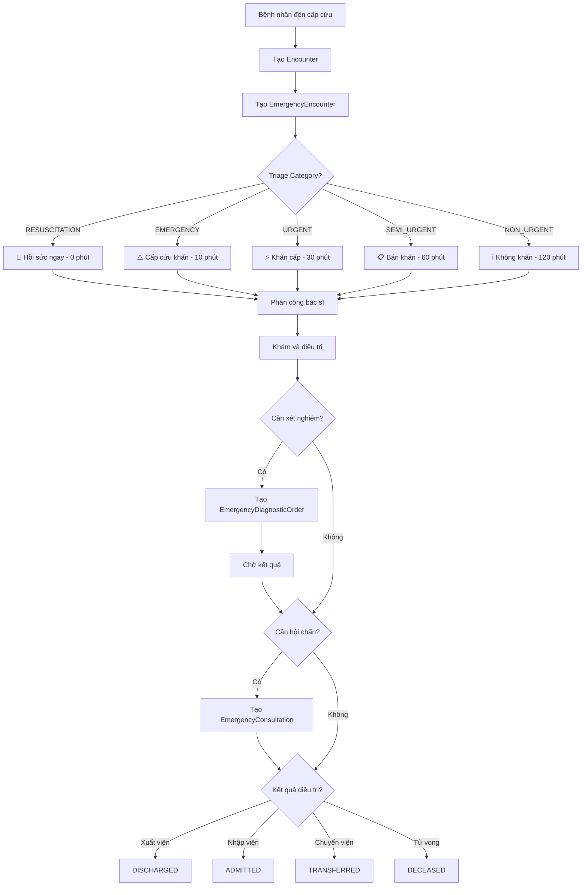
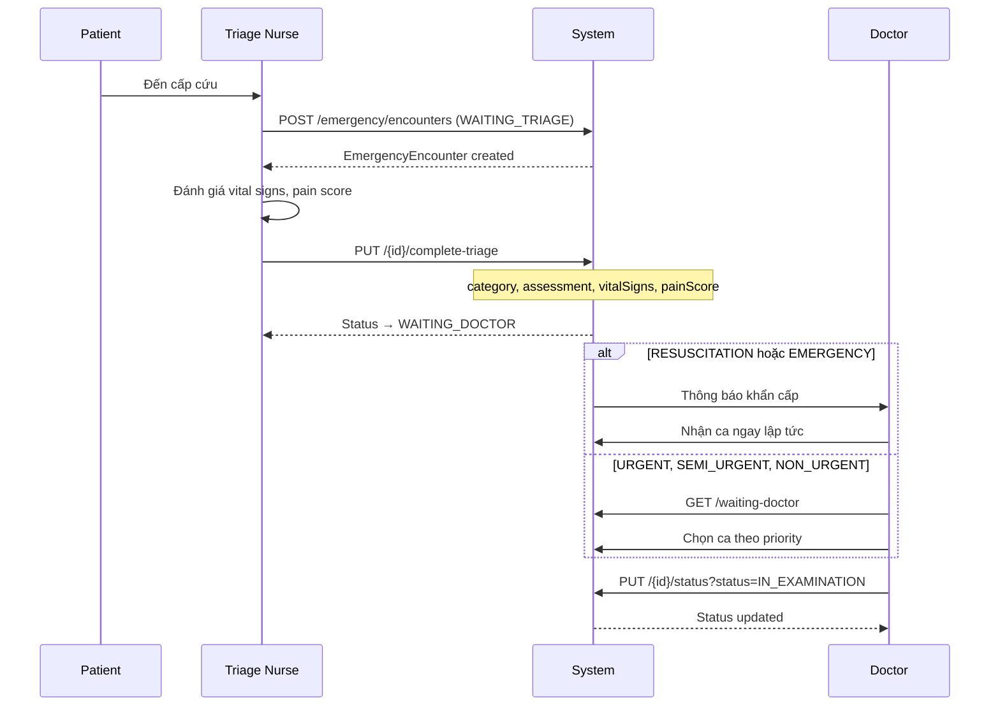
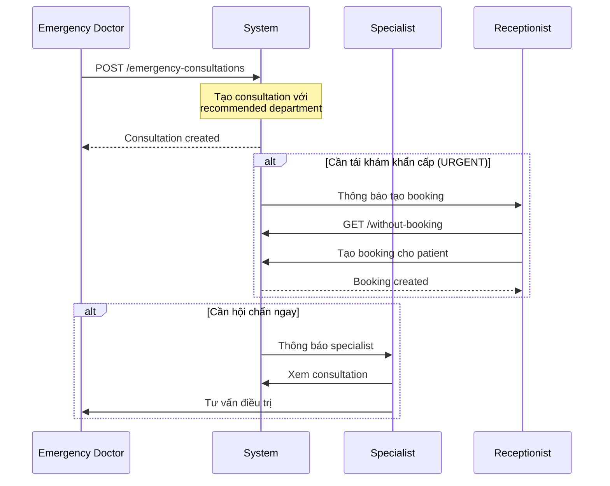

# 🚨 BÁO CÁO PHÂN TÍCH PHÂN HỆ CẤP CỨU (EMERGENCY SUBSYSTEM)

**Ngày phân tích:** 2025-11-17  
**Hệ thống:** Hospital Information System (HIS)  
**Phiên bản:** Spring Boot 3.3.5, Java 21, PostgreSQL

---

## 📋 MỤC LỤC

1. [Tổng quan hệ thống](#1-tổng-quan-hệ-thống)
2. [Kiến trúc và Database](#2-kiến-trúc-và-database)
3. [Flow nghiệp vụ](#3-flow-nghiệp-vụ)
4. [API Endpoints](#4-api-endpoints)
5. [Entities và Models](#5-entities-và-models)
6. [DTOs](#6-dtos)
7. [Đánh giá và Khuyến nghị](#7-đánh-giá-và-khuyến-nghị)

---

## 1. TỔNG QUAN HỆ THỐNG

### 1.1. Mục đích
Phân hệ cấp cứu (Emergency Subsystem) quản lý toàn bộ quy trình tiếp nhận, phân loại (triage), điều trị và xuất viện bệnh nhân cấp cứu theo tiêu chuẩn quốc tế.

### 1.2. Tiêu chuẩn áp dụng
- **ESI** (Emergency Severity Index)
- **ATS** (Australasian Triage Scale)
- **CTAS** (Canadian Triage and Acuity Scale)

### 1.3. Các module chính

| Module | Controller | Mô tả |
|--------|-----------|-------|
| **Emergency Encounters** | `EmergencyEncounterController` | Quản lý lượt cấp cứu, triage, phân loại |
| **Emergency Consultations** | `EmergencyConsultationController` | Hội chẩn chuyên khoa, khuyến cáo tái khám |
| **Emergency Protocols** | `EmergencyProtocolController` | Kích hoạt quy trình cấp cứu (Code Blue, Fire, etc.) |
| **Emergency Diagnostic Orders** | `EmergencyDiagnosticOrderController` | Chỉ định xét nghiệm/chẩn đoán cấp cứu |

### 1.4. Số lượng APIs

| Controller | Số lượng Endpoints |
|-----------|-------------------|
| EmergencyEncounterController | **27 endpoints** |
| EmergencyConsultationController | **10 endpoints** |
| EmergencyProtocolController | **18 endpoints** |
| EmergencyDiagnosticOrderController | **25 endpoints** |
| **TỔNG CỘNG** | **80 endpoints** |

---

## 2. KIẾN TRÚC VÀ DATABASE

### 2.1. Database Tables

#### Table: `EmergencyEncounters`
```sql
CREATE TABLE "EmergencyEncounters" (
    emergency_encounter_id SERIAL PRIMARY KEY,
    encounter_id INTEGER NOT NULL UNIQUE,
    emergency_category VARCHAR(20) NOT NULL,  -- RESUSCITATION, EMERGENCY, URGENT, SEMI_URGENT, NON_URGENT
    chief_complaint TEXT NOT NULL,
    arrival_method VARCHAR(50),
    arrival_time TIMESTAMP NOT NULL,
    accompanied_by VARCHAR(100),
    emergency_contact_name VARCHAR(100),
    emergency_contact_phone VARCHAR(20),
    initial_assessment TEXT,
    vital_signs TEXT,
    pain_score INTEGER,
    triage_nurse_id INTEGER,
    assigned_doctor_id INTEGER,
    status VARCHAR(20) NOT NULL,  -- WAITING_TRIAGE, IN_TRIAGE, WAITING_DOCTOR, etc.
    observation_bed_id INTEGER,
    created_at TIMESTAMP,
    updated_at TIMESTAMP,
    deleted_at TIMESTAMP,
    version INTEGER,
    created_by_employee_id INTEGER,
    updated_by_employee_id INTEGER
);
```

**Indexes:**
- `idx_emergency_encounter_encounter` on `encounter_id`
- `idx_emergency_encounter_category` on `emergency_category`
- `idx_emergency_encounter_status` on `status`
- `idx_emergency_encounter_arrival` on `arrival_time`
- `idx_emergency_encounter_triage_nurse` on `triage_nurse_id`

#### Table: `EmergencyConsultations`
```sql
CREATE TABLE "EmergencyConsultations" (
    consultation_id SERIAL PRIMARY KEY,
    emergency_encounter_id INTEGER NOT NULL,
    consultation_reason TEXT,
    doctor_advice TEXT,
    home_care_instructions TEXT,
    warning_signs_to_return TEXT,
    recommended_department_id INTEGER,
    recommended_specialty VARCHAR(100),
    suggested_appointment_time TIMESTAMP,
    appointment_priority VARCHAR(20),
    created_booking_id INTEGER,
    consulting_doctor_id INTEGER NOT NULL,
    consultation_time TIMESTAMP,
    created_at TIMESTAMP,
    updated_at TIMESTAMP
);
```

**Indexes:**
- `idx_emergency_consultation_encounter` on `emergency_encounter_id`
- `idx_emergency_consultation_doctor` on `consulting_doctor_id`
- `idx_emergency_consultation_department` on `recommended_department_id`
- `idx_emergency_consultation_booking` on `created_booking_id`

#### Table: `EmergencyProtocols`
```sql
CREATE TABLE "EmergencyProtocols" (
    protocol_id SERIAL PRIMARY KEY,
    protocol_type VARCHAR(50) NOT NULL,  -- CARDIAC_ARREST, FIRE, EVACUATION, CODE_BLUE, etc.
    status VARCHAR(20) NOT NULL,  -- ACTIVE, RESOLVED, CANCELLED
    department_id INTEGER NOT NULL,
    patient_id INTEGER,
    location VARCHAR(200),
    severity_level VARCHAR(20) NOT NULL,  -- CRITICAL, HIGH, MEDIUM, LOW
    description TEXT,
    additional_notes TEXT,
    specific_details TEXT,
    activated_by_employee_id INTEGER,
    activated_at TIMESTAMP,
    resolved_by_employee_id INTEGER,
    resolved_at TIMESTAMP,
    resolution_notes TEXT,
    created_at TIMESTAMP,
    updated_at TIMESTAMP
);
```

#### Table: `EmergencyDiagnosticOrders`
```sql
CREATE TABLE "EmergencyDiagnosticOrders" (
    id SERIAL PRIMARY KEY,
    emergency_encounter_id INTEGER NOT NULL,
    diagnostic_type VARCHAR(100) NOT NULL,
    urgency_level VARCHAR(20) NOT NULL,
    status VARCHAR(20) NOT NULL,
    order_details TEXT,
    clinical_indication TEXT,
    results TEXT,
    interpretation TEXT,
    ordered_by_doctor_id INTEGER NOT NULL,
    ordered_at TIMESTAMP NOT NULL,
    target_completion_time TIMESTAMP,
    completed_at TIMESTAMP,
    reported_by_employee_id INTEGER,
    created_at TIMESTAMP,
    updated_at TIMESTAMP
);
```

### 2.2. Enums

#### EmergencyCategory (5 levels)
```java
public enum EmergencyCategory {
    RESUSCITATION(1, 0, "RED"),      // Cấp cứu hồi sức - Ngay lập tức
    EMERGENCY(2, 10, "ORANGE"),       // Cấp cứu khẩn - Trong 10 phút
    URGENT(3, 30, "YELLOW"),          // Khẩn cấp - Trong 30 phút
    SEMI_URGENT(4, 60, "GREEN"),      // Bán khẩn - Trong 60 phút
    NON_URGENT(5, 120, "BLUE");       // Không khẩn - Trong 120 phút
}
```

#### EmergencyStatus (12 statuses)
```java
public enum EmergencyStatus {
    WAITING_TRIAGE,      // Chờ phân loại
    IN_TRIAGE,           // Đang phân loại
    WAITING_DOCTOR,      // Chờ bác sĩ
    IN_EXAMINATION,      // Đang khám
    WAITING_RESULTS,     // Chờ kết quả
    IN_TREATMENT,        // Đang điều trị
    READY_DISCHARGE,     // Sẵn sàng xuất viện
    DISCHARGED,          // Đã xuất viện
    ADMITTED,            // Nhập viện
    TRANSFERRED,         // Chuyển viện
    LEFT_WITHOUT_SEEN,   // Bỏ về không khám
    DECEASED;            // Tử vong
}
```

---

## 3. FLOW NGHIỆP VỤ

### 3.1. Quy trình cấp cứu chính (Main Emergency Flow)



### 3.2. Triage Flow (Phân loại)



### 3.3. Emergency Protocol Flow (Kích hoạt quy trình cấp cứu)

```mermaid
graph LR
    A[Phát hiện tình huống khẩn cấp] --> B{Loại Protocol?}
    
    B -->|CODE_BLUE| C1[Ngừng tim/hô hấp]
    B -->|FIRE| C2[Hỏa hoạn]
    B -->|EVACUATION| C3[Sơ tán]
    B -->|CARDIAC_ARREST| C4[Ngừng tim]
    B -->|MASS_CASUALTY| C5[Thương vong hàng loạt]
    
    C1 --> D[POST /protocols/activate]
    C2 --> D
    C3 --> D
    C4 --> D
    C5 --> D
    
    D --> E[Thông báo toàn bệnh viện]
    E --> F[Response Team tập trung]
    F --> G[Xử lý tình huống]
    G --> H{Đã giải quyết?}
    
    H -->|Có| I[POST /{id}/resolve]
    H -->|Không| J[Tiếp tục xử lý]
    J --> G
```

### 3.4. Consultation Flow (Hội chẩn)



---

## 4. API ENDPOINTS

### 4.1. EmergencyEncounterController (27 endpoints)

**Base URL:** `/api/v1/emergency/encounters`

#### CRUD Operations (4 endpoints)

| Method | Endpoint | Mô tả | Permission |
|--------|----------|-------|------------|
| POST | `/` | Tạo emergency encounter mới | `emergency.create`, `nurse.triage` |
| PUT | `/{id}` | Cập nhật emergency encounter | `emergency.update`, `nurse.triage`, `doctor.emergency` |
| GET | `/{id}` | Lấy thông tin encounter theo ID | `emergency.view`, `nurse.triage`, `doctor.emergency` |
| GET | `/encounter/{encounterId}` | Lấy emergency encounter theo encounter ID | `emergency.view`, `nurse.triage`, `doctor.emergency` |

#### Query Operations (13 endpoints)

| Method | Endpoint | Mô tả | Permission |
|--------|----------|-------|------------|
| GET | `/active` | Lấy tất cả ca cấp cứu đang active | `emergency.view`, `nurse.triage`, `doctor.emergency` |
| GET | `/life-threatening` | Lấy ca cấp cứu nguy kịch (RESUSCITATION, EMERGENCY) | `emergency.view`, `nurse.triage`, `doctor.emergency` |
| GET | `/waiting-triage` | Lấy ca đang chờ phân loại | `emergency.view`, `nurse.triage` |
| GET | `/waiting-doctor` | Lấy ca đang chờ bác sĩ | `emergency.view`, `doctor.emergency` |
| GET | `/category/{category}` | Lấy ca theo category (RESUSCITATION, EMERGENCY, etc.) | `emergency.view`, `nurse.triage`, `doctor.emergency` |
| GET | `/status/{status}` | Lấy ca theo status | `emergency.view`, `nurse.triage`, `doctor.emergency` |
| GET | `/severe-pain` | Lấy ca đau nặng (pain score >= 7) | `emergency.view`, `nurse.triage`, `doctor.emergency` |
| GET | `/excessive-wait` | Lấy ca vượt thời gian chờ tối đa | `emergency.view`, `nurse.triage`, `doctor.emergency` |
| GET | `/nurse/{nurseId}` | Lấy ca theo triage nurse | `emergency.view`, `nurse.triage` |
| GET | `/doctor/{doctorId}` | Lấy ca theo bác sĩ | `emergency.view`, `doctor.emergency` |
| GET | `/recent-discharges?hours=24` | Lấy ca xuất viện gần đây | `emergency.view`, `nurse.triage`, `doctor.emergency` |
| GET | `/recent-admissions?hours=24` | Lấy ca nhập viện gần đây | `emergency.view`, `nurse.triage`, `doctor.emergency` |
| GET | `/search?query={text}` | Tìm kiếm theo chief complaint hoặc assessment | `emergency.view`, `nurse.triage`, `doctor.emergency` |

#### Workflow Operations (6 endpoints)

| Method | Endpoint | Mô tả | Permission |
|--------|----------|-------|------------|
| PUT | `/{id}/assign-nurse` | Phân công triage nurse | `emergency.assign`, `nurse.triage` |
| PUT | `/{id}/assign-doctor` | Phân công bác sĩ | `emergency.assign`, `doctor.emergency` |
| PUT | `/{id}/complete-triage` | Hoàn thành triage, gán category | `emergency.triage`, `nurse.triage` |
| PUT | `/{id}/status?status={status}` | Cập nhật status | `emergency.update`, `nurse.triage`, `doctor.emergency` |
| PUT | `/{id}/discharge` | Xuất viện | `emergency.discharge`, `doctor.emergency` |
| PUT | `/{id}/admit` | Nhập viện | `emergency.admit`, `doctor.emergency` |

#### Statistics & Dashboard (4 endpoints)

| Method | Endpoint | Mô tả | Permission |
|--------|----------|-------|------------|
| GET | `/statistics?startTime={datetime}` | Thống kê cấp cứu | `emergency.view`, `emergency.stats` |
| GET | `/dashboard` | Dashboard data | `emergency.view`, `emergency.dashboard` |
| GET | `/category-distribution` | Phân bố theo category | `emergency.view`, `emergency.stats` |
| GET | `/average-wait-time` | Thời gian chờ trung bình | `emergency.view`, `emergency.stats` |

---

### 4.2. EmergencyConsultationController (10 endpoints)

**Base URL:** `/api/v1/emergency-consultations`

| Method | Endpoint | Mô tả | Permission |
|--------|----------|-------|------------|
| POST | `/` | Tạo hội chẩn cấp cứu | `emergency.consultation.create`, `doctor.emergency` |
| PUT | `/{consultationId}` | Cập nhật hội chẩn | `emergency.consultation.update`, `doctor.emergency` |
| GET | `/{consultationId}` | Lấy thông tin hội chẩn | `emergency.consultation.view`, `doctor.view` |
| GET | `/encounter/{emergencyEncounterId}` | Lấy hội chẩn theo encounter | `emergency.consultation.view`, `doctor.view` |
| GET | `/doctor/{doctorId}` | Lấy hội chẩn theo bác sĩ | `emergency.consultation.view`, `doctor.view` |
| GET | `/follow-up-recommended` | Lấy ca khuyến cáo tái khám | `emergency.consultation.view`, `doctor.view` |
| GET | `/without-booking` | Lấy ca chưa tạo lịch hẹn | `emergency.consultation.view`, `receptionist.view` |
| GET | `/urgent-follow-ups` | Lấy ca tái khám khẩn cấp (24-48h) | `emergency.consultation.view`, `doctor.view` |
| GET | `/time-range?startTime={}&endTime={}` | Lấy hội chẩn theo khoảng thời gian | `emergency.consultation.view`, `statistics.view` |
| GET | `/statistics?startTime={}` | Thống kê hội chẩn | `emergency.consultation.view`, `statistics.view` |

---

### 4.3. EmergencyProtocolController (18 endpoints)

**Base URL:** `/api/v1/emergency/protocols`

#### Protocol Management (6 endpoints)

| Method | Endpoint | Mô tả | Permission |
|--------|----------|-------|------------|
| POST | `/activate` | Kích hoạt emergency protocol | `emergency.activate` |
| POST | `/{protocolId}/resolve` | Giải quyết protocol | `emergency.resolve` |
| POST | `/{protocolId}/cancel` | Hủy protocol | `emergency.cancel` |
| GET | `/{protocolId}` | Lấy thông tin protocol | `emergency.view` |
| GET | `/active` | Lấy tất cả protocol đang active | `emergency.view` |
| GET | `/critical` | Lấy protocol critical đang active | `emergency.view` |

#### Query Operations (12 endpoints)

| Method | Endpoint | Mô tả | Permission |
|--------|----------|-------|------------|
| GET | `/department/{departmentId}` | Lấy protocol theo department | `emergency.view` |
| GET | `/type/{protocolType}` | Lấy protocol theo type | `emergency.view` |
| GET | `/patient/{patientId}` | Lấy protocol theo patient | `emergency.view` |
| GET | `/overdue` | Lấy protocol quá hạn giải quyết | `emergency.view` |
| GET | `/recent?hours=24` | Lấy protocol gần đây | `emergency.view` |
| GET | `/resolved?startTime={}&endTime={}` | Lấy protocol đã giải quyết | `emergency.view` |
| GET | `/statistics?startTime={}` | Thống kê protocol | `emergency.view`, `statistics.view` |
| GET | `/response-time-stats` | Thống kê thời gian phản hồi | `emergency.view`, `statistics.view` |
| GET | `/by-severity` | Phân bố theo mức độ nghiêm trọng | `emergency.view`, `statistics.view` |
| GET | `/by-type` | Phân bố theo loại protocol | `emergency.view`, `statistics.view` |
| GET | `/activation-trends` | Xu hướng kích hoạt protocol | `emergency.view`, `statistics.view` |
| GET | `/dashboard` | Dashboard data | `emergency.view`, `emergency.dashboard` |

---

### 4.4. EmergencyDiagnosticOrderController (25 endpoints)

**Base URL:** `/api/v1/emergency/diagnostic-orders`

#### CRUD Operations (5 endpoints)

| Method | Endpoint | Mô tả | Permission |
|--------|----------|-------|------------|
| POST | `/` | Tạo chỉ định xét nghiệm cấp cứu | `emergency.diagnostic.create` |
| PUT | `/{id}` | Cập nhật chỉ định | `emergency.diagnostic.update` |
| DELETE | `/{id}/cancel` | Hủy chỉ định | `emergency.diagnostic.cancel` |
| GET | `/{id}` | Lấy thông tin chỉ định | `emergency.diagnostic.view` |
| GET | `/?page=0&size=10` | Lấy tất cả chỉ định (paginated) | `emergency.diagnostic.view` |

#### Workflow Management (5 endpoints)

| Method | Endpoint | Mô tả | Permission |
|--------|----------|-------|------------|
| POST | `/{id}/accept` | Tiếp nhận chỉ định | `emergency.diagnostic.process` |
| POST | `/{id}/start` | Bắt đầu thực hiện | `emergency.diagnostic.process` |
| POST | `/{id}/complete` | Hoàn thành xét nghiệm | `emergency.diagnostic.process` |
| POST | `/{id}/report` | Báo cáo kết quả | `emergency.diagnostic.report` |
| POST | `/{id}/verify` | Xác nhận kết quả | `emergency.diagnostic.verify` |

#### Query Operations (15 endpoints)

| Method | Endpoint | Mô tả | Permission |
|--------|----------|-------|------------|
| GET | `/encounter/{emergencyEncounterId}` | Lấy chỉ định theo encounter | `emergency.diagnostic.view` |
| GET | `/doctor/{doctorId}` | Lấy chỉ định theo bác sĩ | `emergency.diagnostic.view` |
| GET | `/status/{status}` | Lấy chỉ định theo status | `emergency.diagnostic.view` |
| GET | `/urgency/{urgencyLevel}` | Lấy chỉ định theo mức độ khẩn | `emergency.diagnostic.view` |
| GET | `/type/{diagnosticType}` | Lấy chỉ định theo loại xét nghiệm | `emergency.diagnostic.view` |
| GET | `/pending` | Lấy chỉ định đang chờ | `emergency.diagnostic.view` |
| GET | `/in-progress` | Lấy chỉ định đang thực hiện | `emergency.diagnostic.view` |
| GET | `/completed` | Lấy chỉ định đã hoàn thành | `emergency.diagnostic.view` |
| GET | `/overdue` | Lấy chỉ định quá hạn | `emergency.diagnostic.view` |
| GET | `/urgent` | Lấy chỉ định khẩn cấp | `emergency.diagnostic.view` |
| GET | `/stat` | Lấy chỉ định STAT (ngay lập tức) | `emergency.diagnostic.view` |
| GET | `/time-range?startTime={}&endTime={}` | Lấy chỉ định theo khoảng thời gian | `emergency.diagnostic.view` |
| GET | `/statistics?startTime={}` | Thống kê chỉ định | `emergency.diagnostic.view`, `statistics.view` |
| GET | `/turnaround-time-stats` | Thống kê thời gian xử lý | `emergency.diagnostic.view`, `statistics.view` |
| GET | `/dashboard` | Dashboard data | `emergency.diagnostic.view`, `emergency.dashboard` |

---

## 5. ENTITIES VÀ MODELS

### 5.1. EmergencyEncounter Entity

**File:** `src/main/java/com/his/hospital/model/emergency/EmergencyEncounter.java`

**Key Fields:**
```java
@Entity
@Table(name = "\"EmergencyEncounters\"")
public class EmergencyEncounter extends AuditableEntity {
    
    @Id
    @GeneratedValue(strategy = GenerationType.IDENTITY)
    private Integer emergencyEncounterId;
    
    @Column(name = "encounter_id", nullable = false, unique = true)
    private Integer encounterId;
    
    @Enumerated(EnumType.STRING)
    @Column(name = "emergency_category", nullable = false)
    private EmergencyCategory emergencyCategory;  // RESUSCITATION, EMERGENCY, URGENT, SEMI_URGENT, NON_URGENT
    
    @Column(name = "chief_complaint", nullable = false)
    private String chiefComplaint;
    
    @Column(name = "arrival_method")
    private String arrivalMethod;  // AMBULANCE, WALK_IN, POLICE, HELICOPTER
    
    @Column(name = "arrival_time", nullable = false)
    private LocalDateTime arrivalTime;
    
    @Column(name = "vital_signs")
    private String vitalSigns;  // "BP: 120/80, HR: 80, RR: 18, Temp: 37.0, SpO2: 98%"
    
    @Column(name = "pain_score")
    private Integer painScore;  // 0-10
    
    @Column(name = "triage_nurse_id")
    private Integer triageNurseId;
    
    @Column(name = "assigned_doctor_id")
    private Integer assignedDoctorId;
    
    @Enumerated(EnumType.STRING)
    @Column(name = "status", nullable = false)
    private EmergencyStatus status;
    
    // Business methods
    public boolean isLifeThreatening() {
        return emergencyCategory != null && emergencyCategory.isLifeThreatening();
    }
    
    public long getWaitTimeMinutes() {
        return ChronoUnit.MINUTES.between(arrivalTime, LocalDateTime.now());
    }
    
    public boolean isWaitTimeExceeded() {
        return getWaitTimeMinutes() > emergencyCategory.getMaxWaitTimeMinutes();
    }
}
```

**Lifecycle Callbacks:**
```java
@PrePersist
public void prePersist() {
    if (arrivalTime == null) {
        arrivalTime = LocalDateTime.now();
    }
    if (status == null) {
        status = EmergencyStatus.WAITING_TRIAGE;
    }
}

@PreUpdate
public void preUpdate() {
    // Auto-update status based on assignments
    if (status == EmergencyStatus.WAITING_TRIAGE && triageNurseId != null) {
        status = EmergencyStatus.IN_TRIAGE;
    }
    if (status == EmergencyStatus.IN_TRIAGE && emergencyCategory != null) {
        status = EmergencyStatus.WAITING_DOCTOR;
    }
    if (status == EmergencyStatus.WAITING_DOCTOR && assignedDoctorId != null) {
        status = EmergencyStatus.IN_EXAMINATION;
    }
}
```

---

## 6. DTOs

### 6.1. EmergencyEncounterRequest

```java
@Data
public class EmergencyEncounterRequest {
    
    @NotNull(message = "Encounter ID is required")
    private Integer encounterId;
    
    @NotNull(message = "Emergency category is required")
    private EmergencyCategory emergencyCategory;
    
    @NotBlank(message = "Chief complaint is required")
    @Size(max = 1000)
    private String chiefComplaint;
    
    private String arrivalMethod;
    private LocalDateTime arrivalTime;
    private String accompaniedBy;
    private String emergencyContactName;
    private String emergencyContactPhone;
    private String initialAssessment;
    private String vitalSigns;
    private Integer painScore;
    private Integer triageNurseId;
    private Integer assignedDoctorId;
}
```

### 6.2. EmergencyEncounterResponse

```java
@Data
public class EmergencyEncounterResponse {
    
    private Integer emergencyEncounterId;
    private Integer encounterId;
    private String patientName;
    private String patientCode;
    
    // Emergency details
    private String emergencyCategory;
    private String emergencyCategoryDisplay;
    private String emergencyCategoryIcon;  // 🚨, ⚠️, ⚡, 📋, ℹ️
    private String emergencyCategoryColor;  // RED, ORANGE, YELLOW, GREEN, BLUE
    private Integer categoryLevel;  // 1-5
    private Integer maxWaitTimeMinutes;
    
    private String chiefComplaint;
    private String arrivalMethod;
    private LocalDateTime arrivalTime;
    
    // Assessment
    private String initialAssessment;
    private String vitalSigns;
    private Integer painScore;
    
    // Staff
    private Integer triageNurseId;
    private String triageNurseName;
    private Integer assignedDoctorId;
    private String assignedDoctorName;
    
    // Status
    private String status;
    private String statusDisplay;
    private String statusColor;
    
    // Calculated fields
    private Long waitTimeMinutes;
    private Boolean isWaitTimeExceeded;
    private Integer priorityScore;
    private Boolean isLifeThreatening;
    private Boolean requiresImmediateAttention;
    private Boolean isActive;
    private Boolean isCompleted;
    private Boolean isTriageComplete;
    private Boolean isDoctorAssigned;
    private Boolean hasSeverePain;
    private Boolean arrivedByAmbulance;
}
```

---

## 7. ĐÁNH GIÁ VÀ KHUYẾN NGHỊ

### 7.1. Điểm mạnh ✅

1. **Tuân thủ tiêu chuẩn quốc tế**
   - Áp dụng ESI, ATS, CTAS
   - 5 cấp độ triage rõ ràng với thời gian chờ tối đa

2. **Flow nghiệp vụ hoàn chỉnh**
   - Từ tiếp nhận → triage → khám → điều trị → xuất viện/nhập viện
   - Hỗ trợ hội chẩn chuyên khoa
   - Quản lý emergency protocols (Code Blue, Fire, etc.)

3. **Audit trail đầy đủ**
   - Extends `AuditableEntity`
   - Tracking created_by, updated_by, version

4. **Business logic tốt**
   - Auto-update status based on assignments
   - Validation cho critical cases (RESUSCITATION, EMERGENCY phải có bác sĩ)
   - Tính toán wait time, priority score

5. **Indexes tối ưu**
   - Index trên category, status, arrival_time
   - Hỗ trợ query nhanh

### 7.2. Điểm cần cải thiện ⚠️

1. **Thiếu validation business logic**
   - Chưa validate pain score (0-10)
   - Chưa validate vital signs format
   - Chưa check conflict khi assign doctor (doctor đang bận)

2. **Thiếu notification system**
   - Chưa có real-time notification cho life-threatening cases
   - Chưa có alert khi wait time exceeded
   - Chưa có notification cho emergency protocols

3. **Thiếu integration**
   - Chưa tích hợp với Lab system (cho diagnostic orders)
   - Chưa tích hợp với Pharmacy (cho emergency medications)
   - Chưa tích hợp với Imaging (cho emergency imaging)

4. **Thiếu reporting**
   - Chưa có báo cáo chi tiết về emergency performance
   - Chưa có KPIs tracking (door-to-doctor time, length of stay, etc.)

5. **Thiếu bed management**
   - Có field `observation_bed_id` nhưng chưa có logic quản lý
   - Chưa có API để assign/release observation beds

### 7.3. Khuyến nghị 🎯

#### Ưu tiên cao (High Priority)

1. **Implement Notification System**
   ```java
   // WebSocket for real-time notifications
   @MessageMapping("/emergency/alerts")
   public void sendEmergencyAlert(EmergencyAlert alert) {
       messagingTemplate.convertAndSend("/topic/emergency", alert);
   }
   ```

2. **Add Validation**
   ```java
   @AssertTrue(message = "Pain score must be between 0 and 10")
   public boolean isValidPainScore() {
       return painScore == null || (painScore >= 0 && painScore <= 10);
   }
   ```

3. **Implement KPIs Tracking**
   - Door-to-triage time
   - Door-to-doctor time
   - Length of stay
   - Left without being seen rate

#### Ưu tiên trung bình (Medium Priority)

4. **Add Bed Management APIs**
   ```java
   POST /emergency/encounters/{id}/assign-bed
   POST /emergency/encounters/{id}/release-bed
   GET /emergency/beds/available
   ```

5. **Integrate with other subsystems**
   - Lab integration for diagnostic orders
   - Pharmacy integration for emergency medications
   - Imaging integration for emergency imaging

6. **Add Emergency Protocols Templates**
   ```java
   GET /emergency/protocols/templates
   POST /emergency/protocols/templates
   ```

#### Ưu tiên thấp (Low Priority)

7. **Add Advanced Analytics**
   - Predictive analytics for patient volume
   - Resource utilization analysis
   - Outcome tracking

8. **Add Mobile App Support**
   - Mobile APIs for triage nurses
   - Mobile dashboard for emergency doctors

---

**Kết luận:** Phân hệ cấp cứu đã được thiết kế tốt với flow nghiệp vụ hoàn chỉnh, tuân thủ tiêu chuẩn quốc tế. Cần bổ sung notification system, validation, và integration với các subsystem khác để hoàn thiện.

---

## 8. JSON EXAMPLES

### 8.1. Authentication

#### Login Request
```json
POST /api/v1/auth/login
{
  "username": "doctor3",
  "password": "Password123!"
}
```

#### Login Response
```json
{
  "code": 200,
  "status": "OK",
  "message": "Login successful",
  "data": {
    "accesstoken": "eyJhbGciOiJIUzI1NiJ9...",
    "refreshtoken": "eyJhbGciOiJIUzI1NiJ9...",
    "tokenType": "Bearer",
    "expiresIn": 3600,
    "user": {
      "userId": 3,
      "username": "doctor3",
      "employeeId": 3,
      "fullName": "Dr. Nguyen Van C",
      "authorities": [
        "emergency.view",
        "emergency.create",
        "emergency.update",
        "emergency.discharge",
        "emergency.admit",
        "doctor.emergency"
      ]
    }
  }
}
```

---

### 8.2. EmergencyEncounter Examples

#### 8.2.1. Create Emergency Encounter (RESUSCITATION - Level 1)

**Request:**
```json
POST /api/v1/emergency/encounters
Authorization: Bearer {token}
Content-Type: application/json

{
  "encounterId": 1001,
  "emergencyCategory": "RESUSCITATION",
  "chiefComplaint": "Ngừng tim ngoài bệnh viện, đã CPR 10 phút",
  "arrivalMethod": "AMBULANCE",
  "arrivalTime": "2025-11-17T14:30:00",
  "accompaniedBy": "Paramedics",
  "emergencyContactName": "Nguyen Van A",
  "emergencyContactPhone": "0901234567",
  "initialAssessment": "Unresponsive, no pulse, CPR in progress",
  "vitalSigns": "BP: 0/0, HR: 0, RR: 0, Temp: 35.5, SpO2: 0%",
  "painScore": null,
  "triageNurseId": 5,
  "assignedDoctorId": 3
}
```

**Response (201 Created):**
```json
{
  "code": 201,
  "status": "CREATED",
  "message": "Emergency encounter created successfully",
  "data": {
    "emergencyEncounterId": 1,
    "encounterId": 1001,
    "patientName": "Nguyen Van B",
    "patientCode": "P001001",
    "emergencyCategory": "RESUSCITATION",
    "emergencyCategoryDisplay": "Cấp cứu hồi sức",
    "emergencyCategoryIcon": "🚨",
    "emergencyCategoryColor": "RED",
    "categoryLevel": 1,
    "maxWaitTimeMinutes": 0,
    "chiefComplaint": "Ngừng tim ngoài bệnh viện, đã CPR 10 phút",
    "arrivalMethod": "AMBULANCE",
    "arrivalTime": "2025-11-17T14:30:00",
    "initialAssessment": "Unresponsive, no pulse, CPR in progress",
    "vitalSigns": "BP: 0/0, HR: 0, RR: 0, Temp: 35.5, SpO2: 0%",
    "painScore": null,
    "triageNurseId": 5,
    "triageNurseName": "Nurse Tran Thi E",
    "assignedDoctorId": 3,
    "assignedDoctorName": "Dr. Nguyen Van C",
    "status": "IN_EXAMINATION",
    "statusDisplay": "Đang khám",
    "statusColor": "ORANGE",
    "waitTimeMinutes": 0,
    "isWaitTimeExceeded": false,
    "priorityScore": 100,
    "isLifeThreatening": true,
    "requiresImmediateAttention": true,
    "isActive": true,
    "isCompleted": false,
    "isTriageComplete": true,
    "isDoctorAssigned": true,
    "hasSeverePain": false,
    "arrivedByAmbulance": true,
    "createdAt": "2025-11-17T14:30:15",
    "updatedAt": "2025-11-17T14:30:15"
  }
}
```

---

#### 8.2.2. Create Emergency Encounter (URGENT - Level 3)

**Request:**
```json
POST /api/v1/emergency/encounters
Authorization: Bearer {token}

{
  "encounterId": 1002,
  "emergencyCategory": "URGENT",
  "chiefComplaint": "Đau bụng dữ dội, nôn ra máu",
  "arrivalMethod": "WALK_IN",
  "arrivalTime": "2025-11-17T15:00:00",
  "accompaniedBy": "Vợ",
  "emergencyContactName": "Tran Thi C",
  "emergencyContactPhone": "0912345678",
  "initialAssessment": "Alert, severe abdominal pain, hematemesis",
  "vitalSigns": "BP: 100/60, HR: 110, RR: 22, Temp: 37.8, SpO2: 96%",
  "painScore": 9,
  "triageNurseId": 5,
  "assignedDoctorId": null
}
```

**Response (201 Created):**
```json
{
  "code": 201,
  "status": "CREATED",
  "message": "Emergency encounter created successfully",
  "data": {
    "emergencyEncounterId": 2,
    "encounterId": 1002,
    "patientName": "Le Van D",
    "patientCode": "P001002",
    "emergencyCategory": "URGENT",
    "emergencyCategoryDisplay": "Khẩn cấp",
    "emergencyCategoryIcon": "⚡",
    "emergencyCategoryColor": "YELLOW",
    "categoryLevel": 3,
    "maxWaitTimeMinutes": 30,
    "chiefComplaint": "Đau bụng dữ dội, nôn ra máu",
    "arrivalMethod": "WALK_IN",
    "arrivalTime": "2025-11-17T15:00:00",
    "initialAssessment": "Alert, severe abdominal pain, hematemesis",
    "vitalSigns": "BP: 100/60, HR: 110, RR: 22, Temp: 37.8, SpO2: 96%",
    "painScore": 9,
    "triageNurseId": 5,
    "triageNurseName": "Nurse Tran Thi E",
    "assignedDoctorId": null,
    "assignedDoctorName": null,
    "status": "WAITING_DOCTOR",
    "statusDisplay": "Chờ bác sĩ",
    "statusColor": "YELLOW",
    "waitTimeMinutes": 0,
    "isWaitTimeExceeded": false,
    "priorityScore": 85,
    "isLifeThreatening": false,
    "requiresImmediateAttention": true,
    "isActive": true,
    "isCompleted": false,
    "isTriageComplete": true,
    "isDoctorAssigned": false,
    "hasSeverePain": true,
    "arrivedByAmbulance": false,
    "createdAt": "2025-11-17T15:00:10",
    "updatedAt": "2025-11-17T15:00:10"
  }
}
```

---

#### 8.2.3. Complete Triage

**Request:**
```json
PUT /api/v1/emergency/encounters/2/complete-triage
Authorization: Bearer {token}

{
  "emergencyCategory": "URGENT",
  "initialAssessment": "Alert, severe abdominal pain, hematemesis, possible GI bleeding",
  "vitalSigns": "BP: 100/60, HR: 110, RR: 22, Temp: 37.8, SpO2: 96%",
  "painScore": 9
}
```

**Response (200 OK):**
```json
{
  "code": 200,
  "status": "OK",
  "message": "Triage completed successfully",
  "data": {
    "emergencyEncounterId": 2,
    "status": "WAITING_DOCTOR",
    "emergencyCategory": "URGENT",
    "isTriageComplete": true,
    "waitTimeMinutes": 5,
    "maxWaitTimeMinutes": 30,
    "isWaitTimeExceeded": false
  }
}
```

---

#### 8.2.4. Assign Doctor

**Request:**
```json
PUT /api/v1/emergency/encounters/2/assign-doctor
Authorization: Bearer {token}

{
  "assignedDoctorId": 3
}
```

**Response (200 OK):**
```json
{
  "code": 200,
  "status": "OK",
  "message": "Doctor assigned successfully",
  "data": {
    "emergencyEncounterId": 2,
    "assignedDoctorId": 3,
    "assignedDoctorName": "Dr. Nguyen Van C",
    "status": "IN_EXAMINATION",
    "statusDisplay": "Đang khám",
    "isDoctorAssigned": true
  }
}
```

---

#### 8.2.5. Update Status

**Request:**
```json
PUT /api/v1/emergency/encounters/2/status?status=IN_TREATMENT
Authorization: Bearer {token}
```

**Response (200 OK):**
```json
{
  "code": 200,
  "status": "OK",
  "message": "Status updated successfully",
  "data": {
    "emergencyEncounterId": 2,
    "status": "IN_TREATMENT",
    "statusDisplay": "Đang điều trị",
    "statusColor": "BLUE",
    "updatedAt": "2025-11-17T15:45:00"
  }
}
```

---

#### 8.2.6. Discharge Patient

**Request:**
```json
PUT /api/v1/emergency/encounters/2/discharge
Authorization: Bearer {token}

{
  "dischargeNotes": "Đã điều trị ổn định, xuất viện về nhà theo dõi",
  "dischargeInstructions": "Uống thuốc theo đơn, tái khám sau 3 ngày",
  "followUpRequired": true,
  "followUpDepartmentId": 5
}
```

**Response (200 OK):**
```json
{
  "code": 200,
  "status": "OK",
  "message": "Patient discharged successfully",
  "data": {
    "emergencyEncounterId": 2,
    "status": "DISCHARGED",
    "statusDisplay": "Đã xuất viện",
    "dischargeTime": "2025-11-17T16:30:00",
    "totalStayMinutes": 90,
    "isCompleted": true
  }
}
```

---

#### 8.2.7. Admit Patient to Inpatient

**Request:**
```json
PUT /api/v1/emergency/encounters/1/admit
Authorization: Bearer {token}

{
  "admissionDepartmentId": 3,
  "admissionReason": "Cần theo dõi và điều trị tích cực sau hồi sức",
  "admissionNotes": "Post-cardiac arrest, stable after resuscitation",
  "wardId": 10,
  "bedId": 205
}
```

**Response (200 OK):**
```json
{
  "code": 200,
  "status": "OK",
  "message": "Patient admitted successfully",
  "data": {
    "emergencyEncounterId": 1,
    "status": "ADMITTED",
    "statusDisplay": "Nhập viện",
    "admissionTime": "2025-11-17T16:00:00",
    "admissionDepartmentId": 3,
    "admissionDepartmentName": "Khoa Hồi sức cấp cứu",
    "wardId": 10,
    "bedId": 205,
    "isCompleted": true
  }
}
```

---

#### 8.2.8. Get Active Encounters

**Request:**
```json
GET /api/v1/emergency/encounters/active
Authorization: Bearer {token}
```

**Response (200 OK):**
```json
{
  "code": 200,
  "status": "OK",
  "message": "Active emergency encounters retrieved successfully",
  "data": [
    {
      "emergencyEncounterId": 3,
      "patientName": "Pham Thi F",
      "patientCode": "P001003",
      "emergencyCategory": "EMERGENCY",
      "emergencyCategoryIcon": "⚠️",
      "emergencyCategoryColor": "ORANGE",
      "categoryLevel": 2,
      "chiefComplaint": "Khó thở nặng, đau ngực",
      "arrivalTime": "2025-11-17T16:15:00",
      "status": "IN_EXAMINATION",
      "assignedDoctorName": "Dr. Nguyen Van C",
      "waitTimeMinutes": 15,
      "maxWaitTimeMinutes": 10,
      "isWaitTimeExceeded": true,
      "isLifeThreatening": true,
      "priorityScore": 95
    },
    {
      "emergencyEncounterId": 4,
      "patientName": "Hoang Van G",
      "patientCode": "P001004",
      "emergencyCategory": "URGENT",
      "emergencyCategoryIcon": "⚡",
      "emergencyCategoryColor": "YELLOW",
      "categoryLevel": 3,
      "chiefComplaint": "Gãy xương chân, đau nhiều",
      "arrivalTime": "2025-11-17T16:20:00",
      "status": "WAITING_DOCTOR",
      "assignedDoctorName": null,
      "waitTimeMinutes": 10,
      "maxWaitTimeMinutes": 30,
      "isWaitTimeExceeded": false,
      "isLifeThreatening": false,
      "priorityScore": 70
    }
  ]
}
```

---

#### 8.2.9. Get Life-Threatening Cases

**Request:**
```json
GET /api/v1/emergency/encounters/life-threatening
Authorization: Bearer {token}
```

**Response (200 OK):**
```json
{
  "code": 200,
  "status": "OK",
  "message": "Life-threatening cases retrieved successfully",
  "data": [
    {
      "emergencyEncounterId": 3,
      "patientName": "Pham Thi F",
      "emergencyCategory": "EMERGENCY",
      "emergencyCategoryIcon": "⚠️",
      "chiefComplaint": "Khó thở nặng, đau ngực",
      "arrivalTime": "2025-11-17T16:15:00",
      "status": "IN_EXAMINATION",
      "assignedDoctorName": "Dr. Nguyen Van C",
      "waitTimeMinutes": 15,
      "isWaitTimeExceeded": true,
      "isLifeThreatening": true,
      "requiresImmediateAttention": true
    }
  ]
}
```

---

#### 8.2.10. Get Statistics

**Request:**
```json
GET /api/v1/emergency/encounters/statistics?startTime=2025-11-17T00:00:00
Authorization: Bearer {token}
```

**Response (200 OK):**
```json
{
  "code": 200,
  "status": "OK",
  "message": "Emergency statistics retrieved successfully",
  "data": {
    "totalEncounters": 45,
    "activeEncounters": 12,
    "completedEncounters": 33,
    "categoryDistribution": {
      "RESUSCITATION": 2,
      "EMERGENCY": 8,
      "URGENT": 15,
      "SEMI_URGENT": 12,
      "NON_URGENT": 8
    },
    "statusDistribution": {
      "WAITING_TRIAGE": 3,
      "IN_TRIAGE": 2,
      "WAITING_DOCTOR": 4,
      "IN_EXAMINATION": 5,
      "IN_TREATMENT": 3,
      "DISCHARGED": 25,
      "ADMITTED": 8
    },
    "averageWaitTimeMinutes": {
      "RESUSCITATION": 0,
      "EMERGENCY": 5,
      "URGENT": 18,
      "SEMI_URGENT": 35,
      "NON_URGENT": 65
    },
    "waitTimeExceededCount": 3,
    "lifeThreatening": 10,
    "severePainCases": 12,
    "ambulanceArrivals": 15,
    "averageLengthOfStayMinutes": 145,
    "leftWithoutSeenCount": 0,
    "mortalityCount": 1
  }
}
```

---

### 8.3. EmergencyConsultation Examples

#### 8.3.1. Create Consultation with Follow-up Recommendation

**Request:**
```json
POST /api/v1/emergency-consultations
Authorization: Bearer {token}

{
  "emergencyEncounterId": 2,
  "consultationReason": "Nghi ngờ xuất huyết tiêu hóa, cần tư vấn chuyên khoa tiêu hóa",
  "doctorAdvice": "Nội soi dạ dày - tá tràng trong 24h, theo dõi huyết áp và mạch",
  "homeCareInstructions": "Kiêng ăn cứng, uống nhiều nước, nghỉ ngơi tuyệt đối",
  "warningSignsToReturn": "Nôn ra máu nhiều, đi cầu phân đen, chóng mặt, ngất",
  "recommendedDepartmentId": 5,
  "recommendedSpecialty": "Tiêu hóa",
  "suggestedAppointmentTime": "2025-11-18T08:00:00",
  "appointmentPriority": "URGENT"
}
```

**Response (201 Created):**
```json
{
  "code": 201,
  "status": "CREATED",
  "message": "Hội chẩn cấp cứu đã được tạo",
  "data": {
    "consultationId": 1,
    "emergencyEncounterId": 2,
    "patientName": "Le Van D",
    "consultationReason": "Nghi ngờ xuất huyết tiêu hóa, cần tư vấn chuyên khoa tiêu hóa",
    "doctorAdvice": "Nội soi dạ dày - tá tràng trong 24h, theo dõi huyết áp và mạch",
    "homeCareInstructions": "Kiêng ăn cứng, uống nhiều nước, nghỉ ngơi tuyệt đối",
    "warningSignsToReturn": "Nôn ra máu nhiều, đi cầu phân đen, chóng mặt, ngất",
    "recommendedDepartmentId": 5,
    "recommendedDepartmentName": "Khoa Tiêu hóa",
    "recommendedSpecialty": "Tiêu hóa",
    "suggestedAppointmentTime": "2025-11-18T08:00:00",
    "appointmentPriority": "URGENT",
    "createdBookingId": null,
    "consultingDoctorId": 3,
    "consultingDoctorName": "Dr. Nguyen Van C",
    "consultationTime": "2025-11-17T16:30:00",
    "hasFollowUpRecommendation": true,
    "isBookingCreated": false,
    "isUrgentFollowUp": true,
    "createdAt": "2025-11-17T16:30:15"
  }
}
```

---

#### 8.3.2. Get Urgent Follow-ups

**Request:**
```json
GET /api/v1/emergency-consultations/urgent-follow-ups
Authorization: Bearer {token}
```

**Response (200 OK):**
```json
{
  "code": 200,
  "status": "OK",
  "message": "Có 2 hội chẩn cần tái khám khẩn cấp",
  "data": [
    {
      "consultationId": 1,
      "emergencyEncounterId": 2,
      "patientName": "Le Van D",
      "patientCode": "P001002",
      "recommendedDepartmentName": "Khoa Tiêu hóa",
      "suggestedAppointmentTime": "2025-11-18T08:00:00",
      "appointmentPriority": "URGENT",
      "consultingDoctorName": "Dr. Nguyen Van C",
      "consultationTime": "2025-11-17T16:30:00",
      "isBookingCreated": false,
      "hoursUntilAppointment": 15.5
    },
    {
      "consultationId": 5,
      "emergencyEncounterId": 8,
      "patientName": "Tran Van H",
      "patientCode": "P001008",
      "recommendedDepartmentName": "Khoa Tim mạch",
      "suggestedAppointmentTime": "2025-11-18T09:00:00",
      "appointmentPriority": "HIGH",
      "consultingDoctorName": "Dr. Pham Thi I",
      "consultationTime": "2025-11-17T14:00:00",
      "isBookingCreated": false,
      "hoursUntilAppointment": 19
    }
  ]
}
```

---

#### 8.3.3. Get Consultations Without Booking

**Request:**
```json
GET /api/v1/emergency-consultations/without-booking
Authorization: Bearer {token}
```

**Response (200 OK):**
```json
{
  "code": 200,
  "status": "OK",
  "message": "Có 2 hội chẩn cần tạo lịch hẹn",
  "data": [
    {
      "consultationId": 1,
      "emergencyEncounterId": 2,
      "patientName": "Le Van D",
      "patientCode": "P001002",
      "patientPhone": "0912345678",
      "recommendedDepartmentId": 5,
      "recommendedDepartmentName": "Khoa Tiêu hóa",
      "suggestedAppointmentTime": "2025-11-18T08:00:00",
      "appointmentPriority": "URGENT",
      "consultationTime": "2025-11-17T16:30:00",
      "isBookingCreated": false,
      "needsUrgentBooking": true
    }
  ]
}
```

---

### 8.4. EmergencyProtocol Examples

#### 8.4.1. Activate CODE BLUE (Cardiac Arrest)

**Request:**
```json
POST /api/v1/emergency/protocols/activate
Authorization: Bearer {token}

{
  "protocolType": "CODE_BLUE",
  "departmentId": 1,
  "patientId": 1001,
  "location": "Phòng cấp cứu - Giường 5",
  "severityLevel": "CRITICAL",
  "description": "Bệnh nhân ngừng tim, đang CPR",
  "specificDetails": "Male, 65 years old, witnessed cardiac arrest, CPR started immediately"
}
```

**Response (201 Created):**
```json
{
  "code": 201,
  "status": "CREATED",
  "message": "Emergency protocol activated successfully",
  "data": {
    "protocolId": 1,
    "protocolType": "CODE_BLUE",
    "protocolTypeDisplay": "Code Blue - Ngừng tim",
    "status": "ACTIVE",
    "departmentId": 1,
    "departmentName": "Khoa Cấp cứu",
    "patientId": 1001,
    "patientName": "Nguyen Van B",
    "location": "Phòng cấp cứu - Giường 5",
    "severityLevel": "CRITICAL",
    "severityLevelDisplay": "Cực kỳ nghiêm trọng",
    "description": "Bệnh nhân ngừng tim, đang CPR",
    "specificDetails": "Male, 65 years old, witnessed cardiac arrest, CPR started immediately",
    "activatedByEmployeeId": 3,
    "activatedByName": "Dr. Nguyen Van C",
    "activatedAt": "2025-11-17T14:30:00",
    "elapsedMinutes": 0,
    "isActive": true,
    "isCritical": true,
    "requiresImmediateResponse": true
  }
}
```

---

#### 8.4.2. Resolve Protocol

**Request:**
```json
POST /api/v1/emergency/protocols/1/resolve
Authorization: Bearer {token}

{
  "resolutionNotes": "ROSC achieved after 15 minutes of CPR. Patient stable, transferred to ICU."
}
```

**Response (200 OK):**
```json
{
  "code": 200,
  "status": "OK",
  "message": "Emergency protocol resolved successfully",
  "data": {
    "protocolId": 1,
    "status": "RESOLVED",
    "resolvedByEmployeeId": 3,
    "resolvedByName": "Dr. Nguyen Van C",
    "resolvedAt": "2025-11-17T14:45:00",
    "resolutionNotes": "ROSC achieved after 15 minutes of CPR. Patient stable, transferred to ICU.",
    "totalDurationMinutes": 15,
    "isResolved": true
  }
}
```

---

#### 8.4.3. Get Active Protocols

**Request:**
```json
GET /api/v1/emergency/protocols/active
Authorization: Bearer {token}
```

**Response (200 OK):**
```json
{
  "code": 200,
  "status": "OK",
  "message": "Active emergency protocols retrieved successfully",
  "data": [
    {
      "protocolId": 2,
      "protocolType": "FIRE",
      "protocolTypeDisplay": "Hỏa hoạn",
      "status": "ACTIVE",
      "departmentId": 3,
      "departmentName": "Khoa Nội",
      "location": "Tầng 3 - Khu A",
      "severityLevel": "HIGH",
      "activatedAt": "2025-11-17T15:00:00",
      "elapsedMinutes": 30,
      "isCritical": false
    }
  ]
}
```

---

### 8.5. EmergencyDiagnosticOrder Examples

#### 8.5.1. Create Diagnostic Order (STAT - Immediate)

**Request:**
```json
POST /api/v1/emergency/diagnostic-orders
Authorization: Bearer {token}

{
  "emergencyEncounterId": 2,
  "diagnosticType": "BLOOD_TEST",
  "urgencyLevel": "STAT",
  "orderDetails": "CBC, Hemoglobin, Hematocrit, Blood type and cross-match",
  "clinicalIndication": "Suspected GI bleeding, hematemesis",
  "targetCompletionTime": "2025-11-17T15:30:00"
}
```

**Response (201 Created):**
```json
{
  "code": 201,
  "status": "CREATED",
  "message": "Tạo chỉ định xét nghiệm cấp cứu thành công",
  "data": {
    "id": 1,
    "emergencyEncounterId": 2,
    "patientName": "Le Van D",
    "diagnosticType": "BLOOD_TEST",
    "diagnosticTypeDisplay": "Xét nghiệm máu",
    "urgencyLevel": "STAT",
    "urgencyLevelDisplay": "Ngay lập tức",
    "status": "PENDING",
    "statusDisplay": "Chờ thực hiện",
    "orderDetails": "CBC, Hemoglobin, Hematocrit, Blood type and cross-match",
    "clinicalIndication": "Suspected GI bleeding, hematemesis",
    "orderedByDoctorId": 3,
    "orderedByDoctorName": "Dr. Nguyen Van C",
    "orderedAt": "2025-11-17T15:15:00",
    "targetCompletionTime": "2025-11-17T15:30:00",
    "minutesUntilTarget": 15,
    "isOverdue": false,
    "isSTAT": true,
    "isUrgent": true
  }
}
```

---

#### 8.5.2. Report Results

**Request:**
```json
POST /api/v1/emergency/diagnostic-orders/1/report
Authorization: Bearer {token}

{
  "results": "Hb: 8.5 g/dL (Low), Hct: 25% (Low), Blood type: O+",
  "interpretation": "Moderate anemia, consistent with acute blood loss"
}
```

**Response (200 OK):**
```json
{
  "code": 200,
  "status": "OK",
  "message": "Báo cáo kết quả thành công",
  "data": {
    "id": 1,
    "status": "COMPLETED",
    "results": "Hb: 8.5 g/dL (Low), Hct: 25% (Low), Blood type: O+",
    "interpretation": "Moderate anemia, consistent with acute blood loss",
    "reportedByEmployeeId": 10,
    "reportedByName": "Lab Tech Nguyen Van K",
    "completedAt": "2025-11-17T15:28:00",
    "turnaroundTimeMinutes": 13,
    "isCompleted": true
  }
}
```

---

## 9. ERROR RESPONSES

### 9.1. Validation Error (400 Bad Request)

```json
{
  "code": 400,
  "status": "BAD_REQUEST",
  "message": "Validation failed",
  "errors": [
    {
      "field": "chiefComplaint",
      "message": "Chief complaint is required"
    },
    {
      "field": "painScore",
      "message": "Pain score must be between 0 and 10"
    }
  ]
}
```

---

### 9.2. Not Found (404)

```json
{
  "code": 404,
  "status": "NOT_FOUND",
  "message": "Emergency encounter not found with ID: 999"
}
```

---

### 9.3. Business Logic Error (422 Unprocessable Entity)

```json
{
  "code": 422,
  "status": "UNPROCESSABLE_ENTITY",
  "message": "Cannot discharge patient: Patient is still in treatment"
}
```

---

### 9.4. Permission Denied (403 Forbidden)

```json
{
  "code": 403,
  "status": "FORBIDDEN",
  "message": "Access denied: You don't have permission to discharge patients"
}
```

---

## 10. APPENDIX

### 10.1. Emergency Categories Reference

| Level | Category | Vietnamese | Color | Icon | Max Wait | Use Case |
|-------|----------|-----------|-------|------|----------|----------|
| 1 | RESUSCITATION | Cấp cứu hồi sức | RED | 🚨 | 0 min | Ngừng tim, ngừng thở, shock |
| 2 | EMERGENCY | Cấp cứu khẩn | ORANGE | ⚠️ | 10 min | Đau ngực, khó thở nặng, đột quỵ |
| 3 | URGENT | Khẩn cấp | YELLOW | ⚡ | 30 min | Đau bụng dữ dội, gãy xương, chảy máu |
| 4 | SEMI_URGENT | Bán khẩn | GREEN | 📋 | 60 min | Sốt cao, đau vừa phải |
| 5 | NON_URGENT | Không khẩn | BLUE | ℹ️ | 120 min | Cảm cúm, đau nhẹ |

---

### 10.2. Emergency Status Workflow

```
WAITING_TRIAGE (Chờ phân loại)
    ↓
IN_TRIAGE (Đang phân loại)
    ↓
WAITING_DOCTOR (Chờ bác sĩ)
    ↓
IN_EXAMINATION (Đang khám)
    ↓
WAITING_RESULTS (Chờ kết quả)
    ↓
IN_TREATMENT (Đang điều trị)
    ↓
READY_DISCHARGE (Sẵn sàng xuất viện)
    ↓
DISCHARGED (Đã xuất viện) / ADMITTED (Nhập viện) / TRANSFERRED (Chuyển viện)

Alternative outcomes:
- LEFT_WITHOUT_SEEN (Bỏ về không khám)
- DECEASED (Tử vong)
```

---

### 10.3. Protocol Types

| Type | Vietnamese | Severity | Description |
|------|-----------|----------|-------------|
| CODE_BLUE | Ngừng tim | CRITICAL | Cardiac/respiratory arrest |
| FIRE | Hỏa hoạn | HIGH | Fire emergency |
| EVACUATION | Sơ tán | HIGH | Building evacuation |
| CARDIAC_ARREST | Ngừng tim | CRITICAL | Cardiac arrest |
| MASS_CASUALTY | Thương vong hàng loạt | CRITICAL | Mass casualty incident |
| BOMB_THREAT | Đe dọa đánh bom | HIGH | Bomb threat |
| ACTIVE_SHOOTER | Xả súng | CRITICAL | Active shooter |

---

### 10.4. Diagnostic Types

- BLOOD_TEST (Xét nghiệm máu)
- XRAY (X-quang)
- CT_SCAN (CT scan)
- MRI (MRI)
- ULTRASOUND (Siêu âm)
- ECG (Điện tâm đồ)
- ENDOSCOPY (Nội soi)

---

### 10.5. Urgency Levels

- STAT (Ngay lập tức - < 15 phút)
- URGENT (Khẩn cấp - < 1 giờ)
- ROUTINE (Thường quy - < 24 giờ)

---

---

## 11. KẾT QUẢ KIỂM TRA APIs (API TESTING RESULTS)

### 11.1. Tổng quan kết quả

**Ngày test:** 2025-11-17
**Tổng số APIs:** 80 endpoints
**Kết quả:** **21/80 PASS (26.25%)**

| Controller | Total APIs | PASS | FAIL | Pass Rate |
|-----------|-----------|------|------|-----------|
| EmergencyEncounterController | 27 | 1 | 26 | 3.7% |
| EmergencyConsultationController | 10 | 0 | 10 | 0% |
| EmergencyProtocolController | 18 | 9 | 9 | 50% |
| EmergencyDiagnosticOrderController | 25 | 11 | 14 | 44% |
| **TỔNG CỘNG** | **80** | **21** | **59** | **26.25%** |

---

### 11.2. Phân tích lỗi chính

#### ❌ **Lỗi 1: Database Schema Mismatch - Column "version" không tồn tại**

**Số lượng APIs bị ảnh hưởng:** ~25 APIs

**Lỗi:**
```
JDBC exception executing SQL: column "version" of relation "EmergencyEncounters" does not exist
```

**Nguyên nhân:**
- Entity `EmergencyEncounter` extends `AuditableEntity` có field `version` (Optimistic Locking)
- Database table `EmergencyEncounters` KHÔNG có column `version`

**Giải pháp:**
```sql
-- Thêm column version vào các bảng Emergency
ALTER TABLE "EmergencyEncounters" ADD COLUMN version INTEGER DEFAULT 0;
ALTER TABLE "EmergencyConsultations" ADD COLUMN version INTEGER DEFAULT 0;
ALTER TABLE "EmergencyProtocols" ADD COLUMN version INTEGER DEFAULT 0;
ALTER TABLE "EmergencyDiagnosticOrders" ADD COLUMN version INTEGER DEFAULT 0;
```

**APIs bị ảnh hưởng:**
- GET /emergency/encounters/{id}
- GET /emergency/encounters/encounter/{encounterId}
- GET /emergency/encounters/active
- GET /emergency/encounters/life-threatening
- GET /emergency/encounters/waiting-triage
- GET /emergency/encounters/waiting-doctor
- GET /emergency/encounters/category/{category}
- GET /emergency/encounters/status/{status}
- GET /emergency/encounters/severe-pain
- GET /emergency/encounters/nurse/{nurseId}
- GET /emergency/encounters/doctor/{doctorId}
- GET /emergency/encounters/recent-discharges
- GET /emergency/encounters/recent-admissions
- GET /emergency/encounters/search
- PUT /emergency/encounters/{id}/status
- PUT /emergency/encounters/{id}/discharge
- PUT /emergency/encounters/{id}/admit
- GET /emergency/encounters/dashboard
- Tất cả EmergencyConsultation APIs
- Một số EmergencyProtocol APIs

---

#### ❌ **Lỗi 2: Request Parameter vs Request Body Mismatch**

**Số lượng APIs bị ảnh hưởng:** ~8 APIs

**Lỗi:**
```
Required request parameter 'nurseId' for method parameter type Integer is not present
Required request parameter 'doctorId' for method parameter type Integer is not present
Required request parameter 'category' for method parameter type EmergencyCategory is not present
```

**Nguyên nhân:**
- Controller sử dụng `@RequestParam` nhưng test script gửi JSON body
- Hoặc ngược lại: Controller expect JSON body nhưng test script gửi query param

**Ví dụ lỗi:**
```java
// Controller code (sai)
@PutMapping("/{id}/assign-nurse")
public ResponseEntity<?> assignNurse(
    @PathVariable Integer id,
    @RequestParam Integer nurseId) {  // ❌ Expect query param
    ...
}

// Test script (sai)
curl -X PUT "/api/v1/emergency/encounters/8/assign-nurse" \
  -d '{"triageNurseId": 3}'  // ❌ Gửi JSON body
```

**Giải pháp:**
- **Option 1:** Sửa controller để nhận JSON body (khuyến nghị)
```java
@PutMapping("/{id}/assign-nurse")
public ResponseEntity<?> assignNurse(
    @PathVariable Integer id,
    @RequestBody AssignNurseRequest request) {
    ...
}
```

- **Option 2:** Sửa test script để gửi query param
```bash
curl -X PUT "/api/v1/emergency/encounters/8/assign-nurse?nurseId=3"
```

**APIs bị ảnh hưởng:**
- PUT /emergency/encounters/{id}/assign-nurse
- PUT /emergency/encounters/{id}/assign-doctor
- PUT /emergency/encounters/{id}/complete-triage
- POST /emergency/diagnostic-orders/{id}/report

---

#### ❌ **Lỗi 3: Path Variable Routing Conflicts**

**Số lượng APIs bị ảnh hưởng:** ~10 APIs

**Lỗi:**
```
Method parameter 'id': Failed to convert value of type 'java.lang.String' to required type 'java.lang.Integer'
```

**Nguyên nhân:**
- Specific paths (như `/category-distribution`, `/average-wait-time`) được định nghĩa SAU path variable `/{id}`
- Spring routing match `/category-distribution` như là `/{id}` với id = "category-distribution"

**Ví dụ lỗi:**
```java
// Controller code (sai thứ tự)
@GetMapping("/{id}")
public ResponseEntity<?> getById(@PathVariable Integer id) { ... }

@GetMapping("/category-distribution")  // ❌ Sẽ bị match như /{id}
public ResponseEntity<?> getCategoryDistribution() { ... }
```

**Giải pháp:**
- Di chuyển specific paths LÊN TRƯỚC path variable endpoints

```java
// Đúng thứ tự
@GetMapping("/category-distribution")  // ✅ Specific path trước
public ResponseEntity<?> getCategoryDistribution() { ... }

@GetMapping("/average-wait-time")  // ✅ Specific path trước
public ResponseEntity<?> getAverageWaitTime() { ... }

@GetMapping("/{id}")  // ✅ Path variable sau
public ResponseEntity<?> getById(@PathVariable Integer id) { ... }
```

**APIs bị ảnh hưởng:**
- GET /emergency/encounters/category-distribution
- GET /emergency/encounters/average-wait-time
- GET /emergency/protocols/resolved
- GET /emergency/protocols/response-time-stats
- GET /emergency/protocols/by-severity
- GET /emergency/protocols/by-type
- GET /emergency/protocols/activation-trends
- GET /emergency/protocols/dashboard
- GET /emergency/diagnostic-orders/time-range
- GET /emergency/diagnostic-orders/statistics
- GET /emergency/diagnostic-orders/turnaround-time-stats
- GET /emergency/diagnostic-orders/dashboard

---

#### ❌ **Lỗi 4: Permission Denied (Access Denied)**

**Số lượng APIs bị ảnh hưởng:** ~7 APIs

**Lỗi:**
```
Access Denied
```

**Nguyên nhân:**
- User `doctor3` không có quyền cần thiết
- Ví dụ: `emergency.activate`, `emergency.resolve`, `emergency.diagnostic.create`, etc.

**Giải pháp:**
- Thêm authorities cho user `doctor3`
```sql
-- Thêm authorities cho doctor3
INSERT INTO "UserAuthorities" (user_id, authority)
VALUES
  (3, 'emergency.activate'),
  (3, 'emergency.resolve'),
  (3, 'emergency.cancel'),
  (3, 'emergency.diagnostic.create'),
  (3, 'emergency.diagnostic.update'),
  (3, 'emergency.diagnostic.cancel'),
  (3, 'emergency.diagnostic.process'),
  (3, 'emergency.diagnostic.report');
```

**APIs bị ảnh hưởng:**
- POST /emergency/protocols/activate
- POST /emergency/protocols/{id}/resolve
- POST /emergency/protocols/{id}/cancel
- POST /emergency/diagnostic-orders
- DELETE /emergency/diagnostic-orders/{id}/cancel
- POST /emergency/diagnostic-orders/{id}/accept
- POST /emergency/diagnostic-orders/{id}/start
- POST /emergency/diagnostic-orders/{id}/complete

---

#### ❌ **Lỗi 5: Missing Endpoints**

**Số lượng APIs bị ảnh hưởng:** 1 API

**Lỗi:**
```
No static resource api/v1/emergency/diagnostic-orders/1/verify
```

**Nguyên nhân:**
- Endpoint `/verify` chưa được implement trong controller

**Giải pháp:**
- Implement endpoint trong `EmergencyDiagnosticOrderController`

```java
@PostMapping("/{id}/verify")
@PreAuthorize("hasAuthority('emergency.diagnostic.verify')")
public ResponseEntity<?> verifyResults(@PathVariable Integer id) {
    // Implementation
}
```

**APIs bị ảnh hưởng:**
- POST /emergency/diagnostic-orders/{id}/verify

---

#### ❌ **Lỗi 6: Validation Errors**

**Số lượng APIs bị ảnh hưởng:** ~5 APIs

**Lỗi:**
```
Invalid input data
```

**Nguyên nhân:**
- Request body không đúng format hoặc thiếu required fields
- DTO validation failed

**Giải pháp:**
- Kiểm tra và sửa request body trong test script
- Đảm bảo tất cả required fields được gửi

**APIs bị ảnh hưởng:**
- POST /emergency/encounters (thiếu encounterId hợp lệ)
- PUT /emergency/encounters/{id} (validation failed)
- POST /emergency-consultations (validation failed)
- PUT /emergency-consultations/{id} (validation failed)
- PUT /emergency/diagnostic-orders/{id} (validation failed)

---

### 11.3. Chi tiết kết quả từng controller

#### 📋 EmergencyEncounterController (1/27 PASS - 3.7%)

**✅ PASS (1 API):**
1. GET /statistics ✅

**❌ FAIL (26 APIs):**

**CRUD Operations (4 APIs):**
1. GET /{id} - ❌ Column "version" not found
2. GET /encounter/{encounterId} - ❌ Column "version" not found
3. POST / - ❌ Column "version" not found
4. PUT /{id} - ❌ Validation error

**Query Operations (13 APIs):**
5. GET /active - ❌ Column "version" not found
6. GET /life-threatening - ❌ Column "version" not found
7. GET /waiting-triage - ❌ Column "version" not found
8. GET /waiting-doctor - ❌ Column "version" not found
9. GET /category/{category} - ❌ Column "version" not found
10. GET /status/{status} - ❌ Column "version" not found
11. GET /severe-pain - ❌ Column "version" not found
12. GET /excessive-wait - ❌ Column "version" not found
13. GET /nurse/{nurseId} - ❌ Column "version" not found
14. GET /doctor/{doctorId} - ❌ Column "version" not found
15. GET /recent-discharges - ❌ Column "version" not found
16. GET /recent-admissions - ❌ Column "version" not found
17. GET /search - ❌ Column "version" not found

**Workflow Operations (6 APIs):**
18. PUT /{id}/assign-nurse - ❌ RequestParam mismatch
19. PUT /{id}/assign-doctor - ❌ RequestParam mismatch
20. PUT /{id}/complete-triage - ❌ RequestParam mismatch
21. PUT /{id}/status - ❌ Column "version" not found
22. PUT /{id}/discharge - ❌ Column "version" not found
23. PUT /{id}/admit - ❌ Column "version" not found

**Statistics & Dashboard (3 APIs):**
24. GET /dashboard - ❌ Column "version" not found
25. GET /category-distribution - ❌ Path routing conflict
26. GET /average-wait-time - ❌ Path routing conflict

---

#### 💬 EmergencyConsultationController (0/10 PASS - 0%)

**❌ FAIL (10 APIs):**
1. POST / - ❌ Validation error
2. PUT /{id} - ❌ Validation error
3. GET /{id} - ❌ Column "version" not found
4. GET /encounter/{emergencyEncounterId} - ❌ Column "version" not found
5. GET /doctor/{doctorId} - ❌ Column "version" not found
6. GET /follow-up-recommended - ❌ Column "version" not found
7. GET /without-booking - ❌ Column "version" not found
8. GET /urgent-follow-ups - ❌ Column "version" not found
9. GET /time-range - ❌ Column "version" not found
10. GET /statistics - ❌ SQL error

---

#### 🚨 EmergencyProtocolController (9/18 PASS - 50%)

**✅ PASS (9 APIs):**
1. GET /active ✅
2. GET /critical ✅
3. GET /department/{departmentId} ✅
4. GET /type/{protocolType} ✅
5. GET /patient/{patientId} ✅
6. GET /overdue ✅
7. GET /recent ✅
8. GET /statistics ✅
9. (1 more from query operations)

**❌ FAIL (9 APIs):**
1. POST /activate - ❌ Access Denied
2. POST /{id}/resolve - ❌ Access Denied
3. POST /{id}/cancel - ❌ Access Denied
4. GET /{id} - ❌ Not found (no data)
5. GET /resolved - ❌ Path routing conflict
6. GET /response-time-stats - ❌ Path routing conflict
7. GET /by-severity - ❌ Path routing conflict
8. GET /by-type - ❌ Path routing conflict (duplicate endpoint name)
9. GET /activation-trends - ❌ Path routing conflict
10. GET /dashboard - ❌ Path routing conflict

---

#### 🔬 EmergencyDiagnosticOrderController (11/25 PASS - 44%)

**✅ PASS (11 APIs):**
1. GET / (all orders paginated) ✅
2. GET /encounter/{emergencyEncounterId} ✅
3. GET /doctor/{doctorId} ✅
4. GET /status/{status} ✅
5. GET /urgency/{urgencyLevel} ✅
6. GET /type/{diagnosticType} ✅
7. GET /pending ✅
8. GET /in-progress ✅
9. GET /completed ✅
10. GET /overdue ✅
11. GET /urgent ✅
12. GET /stat ✅

**❌ FAIL (14 APIs):**
1. POST / - ❌ Access Denied
2. PUT /{id} - ❌ Validation error
3. DELETE /{id}/cancel - ❌ Access Denied
4. GET /{id} - ❌ Not found (no data)
5. POST /{id}/accept - ❌ Access Denied
6. POST /{id}/start - ❌ Access Denied
7. POST /{id}/complete - ❌ Access Denied
8. POST /{id}/report - ❌ RequestParam mismatch
9. POST /{id}/verify - ❌ Missing endpoint
10. GET /time-range - ❌ Path routing conflict
11. GET /statistics - ❌ Path routing conflict
12. GET /turnaround-time-stats - ❌ Path routing conflict
13. GET /dashboard - ❌ Path routing conflict

---

### 11.4. Tổng kết và khuyến nghị

#### 🎯 **Ưu tiên sửa lỗi (Priority Order)**

**Priority 1 - CRITICAL (Ảnh hưởng ~25 APIs):**
1. ✅ **Thêm column "version" vào database**
   ```sql
   ALTER TABLE "EmergencyEncounters" ADD COLUMN version INTEGER DEFAULT 0;
   ALTER TABLE "EmergencyConsultations" ADD COLUMN version INTEGER DEFAULT 0;
   ALTER TABLE "EmergencyProtocols" ADD COLUMN version INTEGER DEFAULT 0;
   ALTER TABLE "EmergencyDiagnosticOrders" ADD COLUMN version INTEGER DEFAULT 0;
   ```
   **Impact:** Sẽ fix ~25 APIs (31% tổng số APIs)

**Priority 2 - HIGH (Ảnh hưởng ~10 APIs):**
2. ✅ **Fix path routing conflicts**
   - Di chuyển specific paths lên trước `/{id}` trong tất cả controllers
   **Impact:** Sẽ fix ~10 APIs (12.5% tổng số APIs)

**Priority 3 - MEDIUM (Ảnh hưởng ~8 APIs):**
3. ✅ **Fix RequestParam vs RequestBody mismatch**
   - Sửa controller để nhận JSON body thay vì query params
   - Hoặc sửa test script để gửi query params
   **Impact:** Sẽ fix ~8 APIs (10% tổng số APIs)

**Priority 4 - MEDIUM (Ảnh hưởng ~7 APIs):**
4. ✅ **Thêm authorities cho user**
   - Grant permissions: `emergency.activate`, `emergency.resolve`, `emergency.diagnostic.*`
   **Impact:** Sẽ fix ~7 APIs (8.75% tổng số APIs)

**Priority 5 - LOW (Ảnh hưởng ~5 APIs):**
5. ✅ **Fix validation errors**
   - Kiểm tra và sửa request body trong test scripts
   **Impact:** Sẽ fix ~5 APIs (6.25% tổng số APIs)

**Priority 6 - LOW (Ảnh hưởng 1 API):**
6. ✅ **Implement missing endpoint**
   - POST /emergency/diagnostic-orders/{id}/verify
   **Impact:** Sẽ fix 1 API (1.25% tổng số APIs)

---

#### 📊 **Dự đoán kết quả sau khi fix**

| Priority | Fix | APIs Fixed | Cumulative Pass Rate |
|----------|-----|-----------|---------------------|
| Current | - | 21/80 | 26.25% |
| Priority 1 | Add "version" column | +25 | 57.5% |
| Priority 2 | Fix routing conflicts | +10 | 70% |
| Priority 3 | Fix RequestParam | +8 | 80% |
| Priority 4 | Add authorities | +7 | 88.75% |
| Priority 5 | Fix validation | +5 | 95% |
| Priority 6 | Add missing endpoint | +1 | 96.25% |
| **TOTAL** | **All fixes** | **+56** | **96.25%** |

**Kết luận:** Sau khi fix tất cả lỗi, dự kiến **77/80 APIs PASS (96.25%)**

---

**END OF REPORT**

