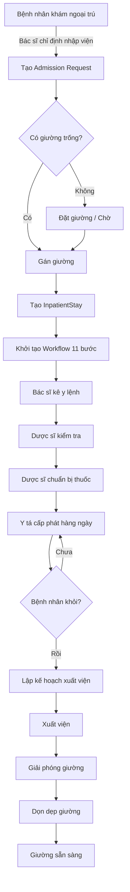
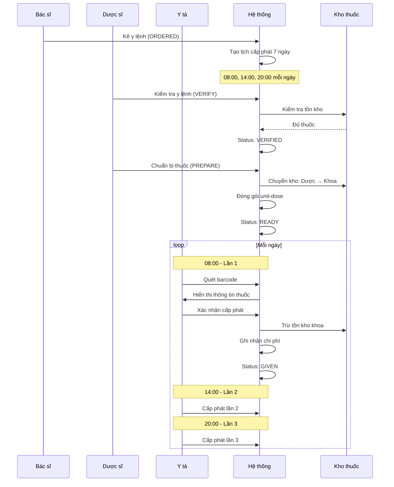
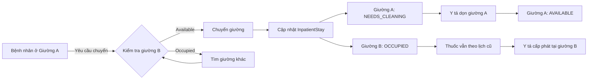

# 🏥 LUỒNG NỘI TRÚ VÀ PHÂN HỆ THUỐC - CHI TIẾT

**Hospital Management System - Spring Boot 3.3.5**  
**Ngày tạo:** 2025-11-19  
**Server:** http://100.96.182.10:8081

---

## 📋 MỤC LỤC

1. [Tổng quan luồng nội trú](#1-tổng-quan-luồng-nội-trú)
2. [Workflow từng bước](#2-workflow-từng-bước)
3. [Vòng đời thuốc hàng ngày](#3-vòng-đời-thuốc-hàng-ngày)
4. [Chuyển giường (Bed Transfer)](#4-chuyển-giường-bed-transfer)
5. [Entities và Relationships](#5-entities-và-relationships)
6. [APIs quan trọng](#6-apis-quan-trọng)

---

## 1. TỔNG QUAN LUỒNG NỘI TRÚ

### 1.1. Quy trình tổng thể

```
OUTPATIENT → ADMISSION → ACTIVE STAY → DISCHARGE
    ↓            ↓            ↓             ↓
  Khám       Nhập viện   Điều trị      Xuất viện
  ngoại trú              nội trú
```

### 1.2. Các thành phần chính

| Component | Entity | Controller | Service |
|-----------|--------|------------|---------|
| **Nội trú** | `InpatientStay` | `InpatientController` | `InpatientStayService` |
| **Giường bệnh** | `HospitalBed` | `BedManagementController` | `BedManagementService` |
| **Chuyển giường** | `BedTransfer` | `BedManagementController` | `BedManagementService` |
| **Y lệnh** | `MedicationOrder` | `MedicationOrderController` | `MedicationOrderService` |
| **Cấp phát thuốc** | `MedicationAdministration` | `MedicationAdministrationController` | `MedicationAdministrationService` |
| **Workflow** | `InpatientWorkflowStatus` | `InpatientWorkflowController` | `InpatientWorkflowStatusService` |
| **Xuất viện** | `DischargePlanning` | `InpatientController` | `DischargePlanningService` |

### 1.3. Trạng thái nội trú

```java
public enum InpatientStatus {
    ACTIVE,      // Đang điều trị
    DISCHARGED,  // Đã xuất viện
    TRANSFERRED  // Đã chuyển viện
}
```

---

## 2. WORKFLOW TỪNG BƯỚC

### 2.1. Bước 1: ADMISSION (Nhập viện)

**API:** `POST /api/v1/inpatient/encounters/{encounterId}/admit`

**Quy trình:**

```
1. Validate encounter (phải là OUTPATIENT)
2. Tìm và gán giường (findAndAssignBed)
   - Ưu tiên giường được chỉ định (preferredBedId)
   - Hoặc tìm giường trống theo loại phòng (roomType)
3. Chuyển encounter type: OUTPATIENT → INPATIENT
4. Tạo InpatientStay record
   - Status: ACTIVE
   - Gán giường (hospitalBedId)
   - Ghi nhận bác sĩ điều trị (attendingDoctorId)
5. Khởi tạo workflow tracking (11 bước chuẩn)
6. Cập nhật giường: AVAILABLE → OCCUPIED
```

**Code snippet:**

<augment_code_snippet path="src/main/java/com/his/hospital/services/impl/InpatientStayServiceImpl.java" mode="EXCERPT">
```java
@Override
@Transactional
public InpatientStayResponse admitPatient(Integer encounterId, AdmissionRequest request, Integer admittingDoctorId) {
    // Validate encounter
    Encounter encounter = encounterRepository.findById(encounterId)
            .orElseThrow(() -> new ResourceNotFoundException("Encounter not found"));
    
    // Find and assign bed
    HospitalBed assignedBed = findAndAssignBed(request);
    
    // Create inpatient stay
    InpatientStay inpatientStay = InpatientStay.builder()
            .encounterId(encounterId)
            .hospitalBedId(assignedBed.getHospitalBedId())
            .currentStatus(InpatientStay.InpatientStatus.ACTIVE)
            .build();
    
    // Initialize workflow
    inpatientWorkflowService.initializeWorkflowForInpatientStay(savedStay.getInpatientStayId());
    ...
}
```
</augment_code_snippet>

### 2.2. Bước 2: WORKFLOW TRACKING (Theo dõi quy trình)

**11 bước workflow chuẩn:**

```java
private static final String[] STANDARD_WORKFLOW_STEPS = {
    "ADMISSION",              // 1. Nhập viện
    "INITIAL_ASSESSMENT",     // 2. Khám ban đầu
    "DIAGNOSTIC_TESTS",       // 3. Xét nghiệm chẩn đoán
    "TREATMENT_PLAN",         // 4. Kế hoạch điều trị
    "MEDICATION",             // 5. Y lệnh thuốc
    "PROCEDURE",              // 6. Thủ thuật
    "SURGERY",                // 7. Phẫu thuật
    "POST_OP_CARE",           // 8. Chăm sóc sau mổ
    "MONITORING",             // 9. Theo dõi
    "DISCHARGE_PLANNING",     // 10. Lập kế hoạch xuất viện
    "DISCHARGE"               // 11. Xuất viện
};
```

**Trạng thái từng bước:**

```
PENDING → IN_PROGRESS → COMPLETED
                    ↓
                 SKIPPED (nếu không cần thiết)
```

**Business rules:**

- ✅ Chỉ 1 bước `IN_PROGRESS` tại một thời điểm
- ✅ Bước đầu tiên (ADMISSION) tự động `IN_PROGRESS`
- ✅ Các bước khác mặc định `PENDING`
- ✅ Có thể `SKIP` bước không cần thiết (ví dụ: SURGERY nếu không phẫu thuật)

**APIs:**

```bash
# Bắt đầu bước
POST /api/v1/inpatient-workflow/steps/{id}/start

# Hoàn thành bước
POST /api/v1/inpatient-workflow/steps/{id}/complete?employeeId=1

# Bỏ qua bước
POST /api/v1/inpatient-workflow/steps/{id}/skip?reason=Not%20needed

# Xem tiến độ
GET /api/v1/inpatient-workflow/stay/{inpatientStayId}
```

### 2.3. Bước 3: MEDICATION ORDERS (Y lệnh điều trị)

**Workflow Y lệnh:**

```
ORDERED → VERIFIED → READY → ADMINISTERED
  ↓          ↓         ↓          ↓
Bác sĩ    Dược sĩ   Dược sĩ    Y tá
kê đơn    kiểm tra  chuẩn bị   cấp phát
```

**Chi tiết từng bước:**

#### 3.1. ORDERED (Bác sĩ kê đơn)

```bash
POST /api/v1/medication-orders
{
  "encounterId": 123,
  "medicineId": 45,
  "dosage": "500mg",
  "route": "ORAL",
  "frequency": "BID",  # 2 lần/ngày
  "durationDays": 7,
  "orderType": "INPATIENT"
}
```

#### 3.2. VERIFIED (Dược sĩ kiểm tra)

```bash
POST /api/v1/medication-orders/{orderId}/verify?notes=Checked
```

**Dược sĩ kiểm tra:**
- ✅ Liều lượng phù hợp
- ✅ Tương tác thuốc
- ✅ Dị ứng bệnh nhân
- ✅ Tồn kho đủ

#### 3.3. READY (Dược sĩ chuẩn bị)

```bash
POST /api/v1/medication-orders/{orderId}/prepare
```

**Quy trình chuẩn bị:**

```
1. Kiểm tra tồn kho tại "Kho Dược" (Cabinet ID: 1)
2. Chuyển thuốc: Kho Dược → Kho lẻ khoa (Cabinet ID: 101)
3. Đóng gói unit-dose (liều đơn vị)
4. Gắn nhãn barcode
5. Cập nhật status: VERIFIED → READY
```

#### 3.4. ADMINISTERED (Y tá cấp phát)

```bash
POST /api/v1/medication-orders/{orderId}/administer
{
  "patientResponse": "Good",
  "adverseReaction": null,
  "notes": "Patient tolerated well"
}
```

**Quy trình cấp phát:**

```
1. Quét barcode thuốc
2. Xác nhận bệnh nhân (5 đúng)
   - Đúng người
   - Đúng thuốc
   - Đúng liều
   - Đúng đường dùng
   - Đúng thời gian
3. Cho thuốc
4. Ghi nhận phản ứng
5. Trừ tồn kho từ "Kho lẻ khoa"
6. Ghi nhận chi phí vào encounter
```

### 2.4. Bước 4: DISCHARGE (Xuất viện)

**Quy trình xuất viện:**

```
1. Lập kế hoạch xuất viện (DischargePlanning)
   - Ngày dự kiến xuất viện
   - Đích đến (nhà, chuyển viện, ...)
   - Thuốc mang về
   - Hướng dẫn chăm sóc
   
2. Kiểm tra điều kiện xuất viện
   - ✅ Tất cả thuốc đã cấp phát
   - ✅ Hóa đơn đã thanh toán
   - ✅ Bác sĩ phê duyệt
   
3. Thực hiện xuất viện
   - Cập nhật InpatientStay: ACTIVE → DISCHARGED
   - Giải phóng giường: OCCUPIED → NEEDS_CLEANING
   - Cập nhật encounter: IN_PROGRESS → COMPLETED
```

**APIs:**

```bash
# Lập kế hoạch xuất viện
POST /api/v1/inpatient/discharge-planning
{
  "inpatientStayId": 1,
  "expectedDischargeDate": "2025-11-25",
  "dischargeDestination": "HOME",
  "dischargeMedications": "Paracetamol 500mg x 10 tablets"
}

# Xuất viện
POST /api/v1/inpatient/stays/{stayId}/discharge
{
  "dischargeDate": "2025-11-25T14:00:00",
  "dischargeSummary": "Patient recovered well..."
}
```

---

## 3. VÒNG ĐỜI THUỐC HÀNG NGÀY

### 3.1. Lịch cấp phát thuốc tự động

**Khi bác sĩ kê đơn thuốc nội trú, hệ thống tự động tạo lịch cấp phát 7 ngày:**

<augment_code_snippet path="src/main/java/com/his/hospital/services/impl/MedicationAdministrationServiceImpl.java" mode="EXCERPT">
```java
private List<MedicationAdministration> createMedicationSchedule(Integer inpatientStayId, PrescriptionItem prescriptionItem) {
    // Lấy thời gian cấp phát từ đơn thuốc
    LocalTime[] administrationTimes = prescriptionItem.getAdministrationTimes();
    if (administrationTimes == null || administrationTimes.length == 0) {
        // Mặc định 3 lần/ngày
        administrationTimes = new LocalTime[]{
            LocalTime.of(8, 0),   // 8:00 AM
            LocalTime.of(14, 0),  // 2:00 PM
            LocalTime.of(20, 0)   // 8:00 PM
        };
    }
    
    // Tạo lịch cho 7 ngày tới
    for (int day = 0; day < 7; day++) {
        for (LocalTime time : administrationTimes) {
            LocalDateTime scheduledDateTime = currentDate.with(time);
            
            MedicationAdministration administration = MedicationAdministration.builder()
                    .prescriptionItemId(prescriptionItem.getPrescriptionItemId())
                    .inpatientStayId(inpatientStayId)
                    .scheduledDatetime(scheduledDateTime)
                    .administrationStatus(AdministrationStatus.PENDING)
                    .build();
            
            schedules.add(administration);
        }
    }
}
```
</augment_code_snippet>

### 3.2. Ví dụ lịch thuốc hàng ngày

**Bệnh nhân A - Giường 101 - Khoa Nội:**

| Thời gian | Thuốc | Liều lượng | Trạng thái | Y tá |
|-----------|-------|------------|------------|------|
| 08:00 | Paracetamol | 500mg | ✅ GIVEN | Nurse A |
| 14:00 | Paracetamol | 500mg | ⏳ PENDING | - |
| 20:00 | Paracetamol | 500mg | ⏳ PENDING | - |
| 08:00 | Amoxicillin | 250mg | ✅ GIVEN | Nurse A |
| 14:00 | Amoxicillin | 250mg | ⏳ PENDING | - |
| 20:00 | Amoxicillin | 250mg | ⏳ PENDING | - |

### 3.3. APIs thuốc hàng ngày

```bash
# Lấy thuốc hôm nay cho bệnh nhân
GET /api/v1/inpatient/medications/stays/{stayId}/today

# Lấy thuốc quá hạn
GET /api/v1/medication-alerts/overdue/stay/{stayId}

# Lấy thuốc sắp tới (30 phút)
GET /api/v1/medication-alerts/upcoming

# Cấp phát thuốc
POST /api/v1/inpatient/medications/{administrationId}/administer
{
  "actualDatetime": "2025-11-19T14:05:00",
  "administrationNotes": "Patient took medication",
  "patientResponse": "Good",
  "sideEffectsObserved": null
}
```

### 3.4. Validation thời gian cấp phát

**Quy tắc:**

```java
LocalDateTime scheduled = administration.getScheduledDatetime();
LocalDateTime earliestTime = scheduled.minusHours(1);  // Sớm nhất 1 giờ
LocalDateTime latestTime = scheduled.plusHours(4);     // Muộn nhất 4 giờ

if (actualTime.isBefore(earliestTime)) {
    throw new BusinessException("Không thể cho thuốc sớm hơn 1 giờ");
}

if (actualTime.isAfter(latestTime)) {
    throw new BusinessException("Thuốc quá muộn. Đánh dấu MISSED và liên hệ bác sĩ");
}
```

**Ví dụ:**

- Lịch: 14:00
- Cho được: 13:00 - 18:00
- Trước 13:00: ❌ Quá sớm
- Sau 18:00: ❌ Quá muộn → MISSED

### 3.5. Trạng thái thuốc

```java
public enum AdministrationStatus {
    PENDING,  // Chờ cấp phát
    GIVEN,    // Đã cho
    REFUSED,  // Bệnh nhân từ chối
    MISSED,   // Bỏ lỡ (quá thời gian)
    HELD      // Tạm dừng (theo y lệnh)
}
```

---

## 4. CHUYỂN GIƯỜNG (BED TRANSFER)

### 4.1. Khi nào chuyển giường?

1. **Chuyển khoa điều trị**
   - Ví dụ: Nội → Ngoại (cần phẫu thuật)
   
2. **Nâng/hạ cấp độ chăm sóc**
   - Ví dụ: Phòng thường → ICU (bệnh nặng)
   - Ví dụ: ICU → Phòng thường (hồi phục)
   
3. **Yêu cầu cách ly**
   - Bệnh nhân nhiễm trùng → Phòng cách ly
   
4. **Yêu cầu đặc biệt**
   - Chuyển phòng VIP
   - Gần cửa sổ, gần nhà vệ sinh, ...

### 4.2. Quy trình chuyển giường

**API:** `POST /api/v1/inpatient/stays/{stayId}/transfer-bed`

```bash
POST /api/v1/inpatient/stays/1/transfer-bed
{
  "newBedId": 205,
  "reason": "Chuyển lên ICU do bệnh nặng",
  "approvedByEmployeeId": 10
}
```

**Quy trình chi tiết:**

<augment_code_snippet path="src/main/java/com/his/hospital/services/impl/InpatientStayServiceImpl.java" mode="EXCERPT">
```java
@Override
@Transactional
public InpatientStayResponse transferBed(Integer stayId, Integer newBedId, String reason, Integer approvedByEmployeeId) {
    // 1. Validate stay đang ACTIVE
    InpatientStay stay = inpatientStayRepository.findById(stayId)
            .orElseThrow(() -> new ResourceNotFoundException("Inpatient stay not found"));
    
    if (!stay.isActive()) {
        throw new BusinessException("Only active stays can be transferred");
    }
    
    // 2. Validate giường mới available
    HospitalBed newBed = hospitalBedRepository.findById(newBedId)
            .orElseThrow(() -> new ResourceNotFoundException("Hospital bed not found"));
    
    if (!newBed.canBeAssigned()) {
        throw new BusinessException("Target bed is not available");
    }
    
    // 3. Giải phóng giường cũ
    if (stay.getHospitalBedId() != null) {
        HospitalBed oldBed = hospitalBedRepository.findById(stay.getHospitalBedId())
                .orElseThrow(() -> new ResourceNotFoundException("Current bed not found"));
        
        // Đánh dấu cần dọn dẹp
        oldBed.markNeedsCleaning();  // OCCUPIED → NEEDS_CLEANING
        hospitalBedRepository.save(oldBed);
    }
    
    // 4. Gán giường mới
    newBed.occupy();  // AVAILABLE → OCCUPIED
    hospitalBedRepository.save(newBed);
    
    // 5. Cập nhật InpatientStay
    stay.setHospitalBedId(newBedId);
    InpatientStay savedStay = inpatientStayRepository.save(stay);
    
    return inpatientStayMapper.toResponse(savedStay);
}
```
</augment_code_snippet>

### 4.3. Thuốc khi chuyển giường

**❓ Câu hỏi: Thuốc có bị ảnh hưởng khi chuyển giường không?**

**✅ Trả lời: KHÔNG bị ảnh hưởng**

**Lý do:**

1. **Thuốc gắn với `inpatientStayId`, KHÔNG gắn với `bedId`**

```java
@Entity
public class MedicationAdministration {
    @Column(name = "inpatient_stay_id", nullable = false)
    private Integer inpatientStayId;  // ← Gắn với stay, không phải bed
    
    @Column(name = "scheduled_datetime")
    private LocalDateTime scheduledDatetime;
    
    @Column(name = "administration_status")
    private AdministrationStatus administrationStatus;
}
```

2. **Khi chuyển giường:**
   - ✅ `inpatientStayId` KHÔNG đổi
   - ✅ Lịch thuốc KHÔNG đổi
   - ✅ Y tá vẫn thấy thuốc theo `stayId`
   - ✅ Chỉ thay đổi `hospitalBedId` trong `InpatientStay`

3. **Y tá tra cứu thuốc:**

```bash
# Lấy thuốc theo stay (không phải bed)
GET /api/v1/inpatient/medications/stays/{stayId}/today

# Response vẫn đầy đủ dù đã chuyển giường
{
  "data": [
    {
      "administrationId": 123,
      "inpatientStayId": 1,
      "scheduledDatetime": "2025-11-19T14:00:00",
      "status": "PENDING",
      "medicine": "Paracetamol 500mg"
    }
  ]
}
```

### 4.4. Lưu ý khi chuyển giường

**✅ Điều KHÔNG thay đổi:**
- Lịch thuốc (vẫn theo `inpatientStayId`)
- Y lệnh điều trị
- Hồ sơ bệnh án
- Encounter ID

**⚠️ Điều CẦN CẬP NHẬT:**
- Thông báo y tá khoa mới
- Cập nhật bảng phân công
- Chuyển hồ sơ giấy (nếu có)
- Thông báo gia đình (nếu cần)

### 4.5. Housekeeping workflow

**Sau khi chuyển giường:**

```
Giường cũ: OCCUPIED → NEEDS_CLEANING
              ↓
         Y tá dọn dẹp
              ↓
    POST /api/v1/bed-management/{bedId}/housekeeping/start
              ↓
         NEEDS_CLEANING → CLEANING
              ↓
         Hoàn thành dọn
              ↓
    POST /api/v1/bed-management/{bedId}/housekeeping/complete
              ↓
         CLEANING → AVAILABLE
```

---

## 5. ENTITIES VÀ RELATIONSHIPS

### 5.1. Entity Relationship Diagram

```
Encounter (1) ──────── (1) InpatientStay
                            │
                            ├── (1) HospitalBed
                            │
                            ├── (N) MedicationAdministration
                            │        │
                            │        └── (1) PrescriptionItem
                            │                 │
                            │                 └── (1) Medicine
                            │
                            ├── (N) InpatientWorkflowStatus
                            │
                            ├── (N) BedTransfer
                            │
                            └── (0..1) DischargePlanning
```

### 5.2. Key Fields

**InpatientStay:**
```java
- inpatientStayId (PK)
- encounterId (FK → Encounter)
- hospitalBedId (FK → HospitalBed)
- admissionDate
- dischargeDate
- currentStatus (ACTIVE/DISCHARGED/TRANSFERRED)
- attendingDoctorId
```

**MedicationAdministration:**
```java
- administrationId (PK)
- inpatientStayId (FK → InpatientStay)  ← QUAN TRỌNG
- prescriptionItemId (FK → PrescriptionItem)
- scheduledDatetime
- actualDatetime
- administrationStatus (PENDING/GIVEN/MISSED/...)
- administeredByNurseId
```

**BedTransfer:**
```java
- bedTransferId (PK)
- inpatientStayId (FK → InpatientStay)
- fromBedId (FK → HospitalBed)
- toBedId (FK → HospitalBed)
- transferDatetime
- reason
- approvedByEmployeeId
```

---

## 6. APIs QUAN TRỌNG

### 6.1. Admission APIs

```bash
# Nhập viện
POST /api/v1/inpatient/encounters/{encounterId}/admit

# Lấy thông tin nội trú
GET /api/v1/inpatient/stays/{stayId}

# Lấy danh sách bệnh nhân đang nội trú
GET /api/v1/inpatient/stays/active
```

### 6.2. Medication APIs

```bash
# Tạo y lệnh
POST /api/v1/medication-orders

# Dược sĩ kiểm tra
POST /api/v1/medication-orders/{orderId}/verify

# Dược sĩ chuẩn bị
POST /api/v1/medication-orders/{orderId}/prepare

# Y tá cấp phát
POST /api/v1/medication-orders/{orderId}/administer

# Lấy thuốc hôm nay
GET /api/v1/inpatient/medications/stays/{stayId}/today

# Lấy thuốc quá hạn
GET /api/v1/medication-alerts/overdue/stay/{stayId}
```

### 6.3. Bed Transfer APIs

```bash
# Chuyển giường
POST /api/v1/inpatient/stays/{stayId}/transfer-bed

# Lấy lịch sử chuyển giường
GET /api/v1/bed-management/transfers/stay/{stayId}

# Tìm giường thay thế
GET /api/v1/bed-management/available?departmentId=1&bedType=ICU
```

### 6.4. Discharge APIs

```bash
# Lập kế hoạch xuất viện
POST /api/v1/inpatient/discharge-planning

# Xuất viện
POST /api/v1/inpatient/stays/{stayId}/discharge

# Hủy lệnh xuất viện
POST /api/v1/inpatient/stays/{stayId}/cancel-discharge-order
```

---

## 7. FLOW DIAGRAMS

### 7.1. Luồng nội trú tổng thể



### 7.2. Vòng đời thuốc hàng ngày



### 7.3. Quy trình chuyển giường



---

## 8. SCHEDULED JOBS (Công việc tự động)

### 8.1. Medication Alerts

**Chạy mỗi 5 phút:**

```java
@Scheduled(cron = "0 */5 * * * *")
public void checkOverdueMedications() {
    // Tìm thuốc quá hạn (> 30 phút)
    // Gửi cảnh báo cho y tá
}
```

### 8.2. Bed Reservation Expiry

**Chạy mỗi 5 phút:**

```java
@Scheduled(cron = "0 */5 * * * *")
public void autoExpireReservations() {
    // Tìm giường đặt trước đã hết hạn
    // Tự động giải phóng: RESERVED → AVAILABLE
}
```

### 8.3. Stock Alerts

**Chạy mỗi ngày 6:00 AM:**

```java
@Scheduled(cron = "0 0 6 * * *")
public void generateLowStockAlerts() {
    // Kiểm tra thuốc sắp hết
    // Tạo cảnh báo cho dược sĩ
}
```

---

## 9. BUSINESS RULES QUAN TRỌNG

### 9.1. Quy tắc nhập viện

✅ **Phải có:**
- Encounter type = OUTPATIENT
- Chưa có InpatientStay
- Có giường trống hoặc đặt trước
- Bác sĩ có quyền nhập viện

❌ **Không được:**
- Nhập viện 2 lần cho cùng encounter
- Gán giường đang OCCUPIED
- Nhập viện khi encounter đã COMPLETED

### 9.2. Quy tắc y lệnh

✅ **Phải có:**
- Encounter đang ACTIVE
- Thuốc còn tồn kho
- Liều lượng hợp lệ
- Không dị ứng

❌ **Không được:**
- Kê đơn cho encounter đã COMPLETED
- STAT và PRN cùng lúc
- Liều lượng vượt quá giới hạn

### 9.3. Quy tắc cấp phát thuốc

✅ **Phải có:**
- Thuốc đã READY
- Trong khung giờ cho phép (±1-4 giờ)
- Xác nhận 5 đúng
- Barcode khớp

❌ **Không được:**
- Cho thuốc quá sớm (> 1 giờ)
- Cho thuốc quá muộn (> 4 giờ)
- Bỏ qua xác nhận bệnh nhân

### 9.4. Quy tắc chuyển giường

✅ **Phải có:**
- InpatientStay đang ACTIVE
- Giường mới AVAILABLE hoặc RESERVED
- Có lý do chuyển
- Được phê duyệt

❌ **Không được:**
- Chuyển khi đang xuất viện
- Chuyển sang giường OCCUPIED
- Chuyển không có lý do

### 9.5. Quy tắc xuất viện

✅ **Phải có:**
- Tất cả thuốc đã cấp phát hoặc HELD
- Hóa đơn đã thanh toán (hoặc tạm ứng đủ)
- Bác sĩ phê duyệt
- Có kế hoạch xuất viện

❌ **Không được:**
- Xuất viện khi còn thuốc PENDING
- Xuất viện khi còn nợ (nếu không cho phép)
- Xuất viện không có discharge summary

---

## 10. PERFORMANCE OPTIMIZATION

### 10.1. Database Indexes

**InpatientStays:**
```sql
CREATE INDEX idx_inpatient_stays_encounter ON "InpatientStays"(encounter_id);
CREATE INDEX idx_inpatient_stays_bed ON "InpatientStays"(hospital_bed_id);
CREATE INDEX idx_inpatient_stays_status ON "InpatientStays"(current_status);
CREATE INDEX idx_inpatient_stays_deleted ON "InpatientStays"(deleted_at);
```

**MedicationAdministration:**
```sql
CREATE INDEX idx_med_admin_stay ON "MedicationAdministration"(inpatient_stay_id);
CREATE INDEX idx_med_admin_status ON "MedicationAdministration"(administration_status);
CREATE INDEX idx_med_admin_scheduled ON "MedicationAdministration"(scheduled_datetime);
CREATE INDEX idx_med_admin_nurse ON "MedicationAdministration"(administered_by_nurse_id);
```

### 10.2. Query Optimization

**Tránh N+1 queries:**

```java
// ❌ BAD - N+1 queries
List<InpatientStay> stays = inpatientStayRepository.findAll();
for (InpatientStay stay : stays) {
    stay.getHospitalBed().getBedNumber(); // Lazy load
}

// ✅ GOOD - Single query with JOIN FETCH
@Query("SELECT s FROM InpatientStay s " +
       "LEFT JOIN FETCH s.hospitalBed " +
       "LEFT JOIN FETCH s.encounter " +
       "WHERE s.currentStatus = 'ACTIVE'")
List<InpatientStay> findActiveStaysWithDetails();
```

### 10.3. Caching Strategy

**Redis cache cho:**
- ✅ Danh sách giường available (TTL: 1 phút)
- ✅ Workflow steps (TTL: 5 phút)
- ✅ Medication schedules hôm nay (TTL: 1 giờ)

**Không cache:**
- ❌ Medication administration status (real-time)
- ❌ Bed occupancy (real-time)
- ❌ Patient vital signs (real-time)

---

## 11. SECURITY & PERMISSIONS

### 11.1. Permissions Required

| Action | Permission | Role |
|--------|-----------|------|
| Nhập viện | `inpatient.admit` | Doctor, Admin |
| Kê y lệnh | `medication.order` | Doctor |
| Kiểm tra y lệnh | `medication.verify` | Pharmacist |
| Chuẩn bị thuốc | `medication.prepare` | Pharmacist |
| Cấp phát thuốc | `medication.administer` | Nurse |
| Chuyển giường | `bed.transfer` | Nurse, Doctor, Admin |
| Xuất viện | `inpatient.discharge` | Doctor, Admin |

### 11.2. Audit Trail

**Tất cả actions được ghi log:**

```java
@Column(name = "created_by_employee_id")
private Integer createdByEmployeeId;

@Column(name = "updated_by_employee_id")
private Integer updatedByEmployeeId;

@CreationTimestamp
@Column(name = "created_at")
private LocalDateTime createdAt;

@UpdateTimestamp
@Column(name = "updated_at")
private LocalDateTime updatedAt;
```

---

## 12. TESTING SCENARIOS

### 12.1. Test Case: Nhập viện thành công

```bash
# 1. Tạo encounter
POST /api/v1/encounters
{
  "patientId": 1,
  "encounterType": "OUTPATIENT",
  "chiefComplaint": "Đau bụng"
}

# 2. Nhập viện
POST /api/v1/inpatient/encounters/1/admit
{
  "admissionDate": "2025-11-19T10:00:00",
  "admissionDiagnosis": "Viêm ruột thừa",
  "attendingDoctorId": 5,
  "preferredBedId": 101
}

# 3. Verify
GET /api/v1/inpatient/stays/1
# Expected: status = ACTIVE, bedId = 101
```

### 12.2. Test Case: Vòng đời thuốc

```bash
# 1. Kê y lệnh
POST /api/v1/medication-orders
{
  "encounterId": 1,
  "medicineId": 10,
  "dosage": "500mg",
  "frequency": "BID"
}

# 2. Dược sĩ kiểm tra
POST /api/v1/medication-orders/1/verify

# 3. Dược sĩ chuẩn bị
POST /api/v1/medication-orders/1/prepare

# 4. Y tá cấp phát
POST /api/v1/medication-orders/1/administer

# 5. Verify
GET /api/v1/inpatient/medications/stays/1/today
# Expected: status = GIVEN
```

### 12.3. Test Case: Chuyển giường

```bash
# 1. Chuyển giường
POST /api/v1/inpatient/stays/1/transfer-bed
{
  "newBedId": 205,
  "reason": "Chuyển lên ICU",
  "approvedByEmployeeId": 10
}

# 2. Verify giường cũ
GET /api/v1/bed-management/beds/101
# Expected: status = NEEDS_CLEANING

# 3. Verify giường mới
GET /api/v1/bed-management/beds/205
# Expected: status = OCCUPIED

# 4. Verify thuốc vẫn hoạt động
GET /api/v1/inpatient/medications/stays/1/today
# Expected: Vẫn có đầy đủ thuốc
```

---

## 13. TROUBLESHOOTING

### 13.1. Lỗi thường gặp

**Lỗi 1: "No available beds found"**

```
Nguyên nhân: Không có giường trống
Giải pháp:
1. Kiểm tra giường: GET /api/v1/bed-management/available
2. Đặt giường trước: POST /api/v1/bed-management/{bedId}/reserve
3. Hoặc chờ xuất viện
```

**Lỗi 2: "Medication cannot be given more than 1 hour early"**

```
Nguyên nhân: Cấp phát thuốc quá sớm
Giải pháp:
1. Đợi đến khung giờ cho phép
2. Hoặc liên hệ bác sĩ thay đổi lịch
```

**Lỗi 3: "Only active stays can be transferred"**

```
Nguyên nhân: Bệnh nhân đã xuất viện
Giải pháp:
1. Kiểm tra status: GET /api/v1/inpatient/stays/{stayId}
2. Không thể chuyển giường sau xuất viện
```

### 13.2. Monitoring

**Metrics cần theo dõi:**

- ⏱️ Average admission time
- 📊 Bed occupancy rate
- 💊 Medication administration on-time rate
- 🚨 Overdue medications count
- 🛏️ Average length of stay
- 📈 Discharge planning completion rate

---

**Tài liệu được tạo bởi:** Augment Agent
**Ngày:** 2025-11-19
**Phiên bản:** 1.0

