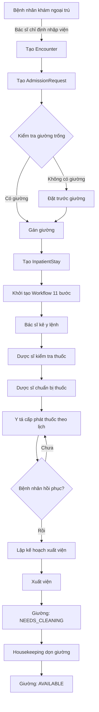
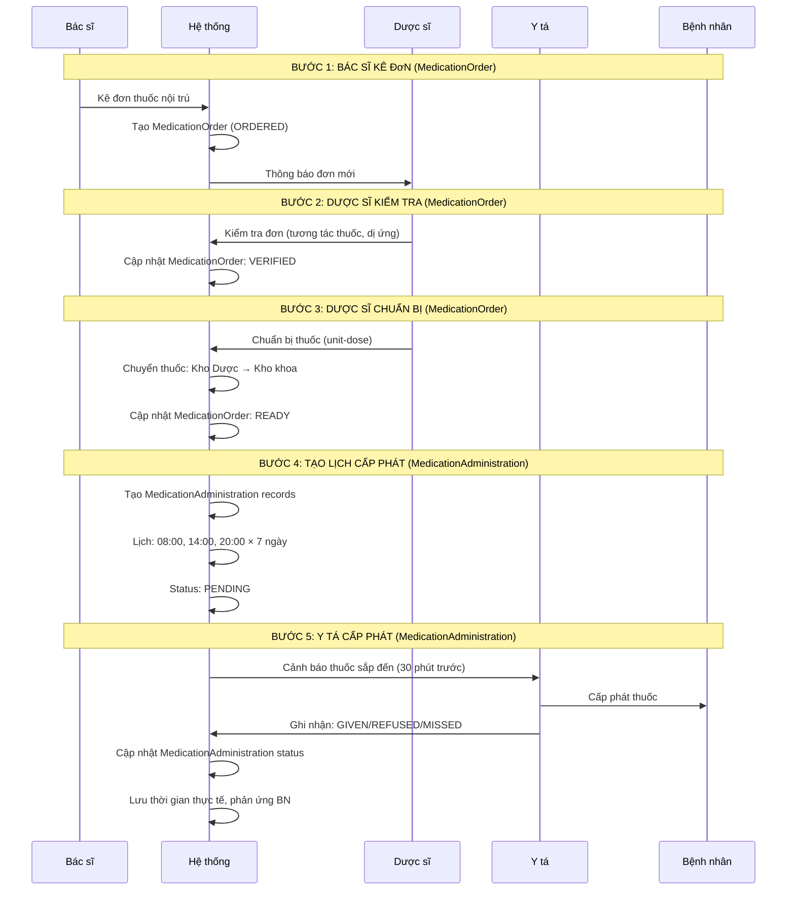
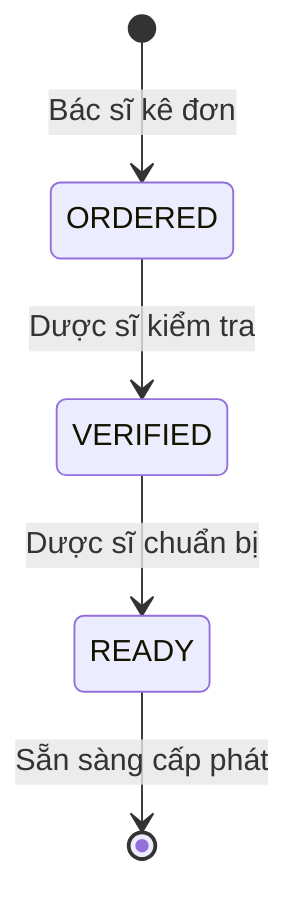
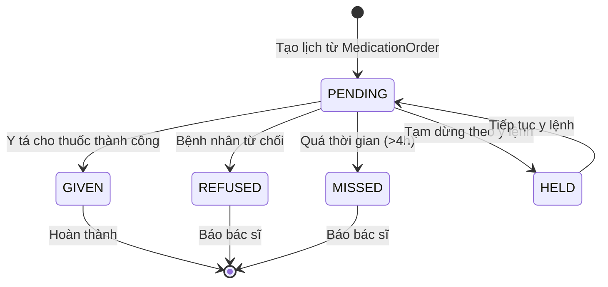
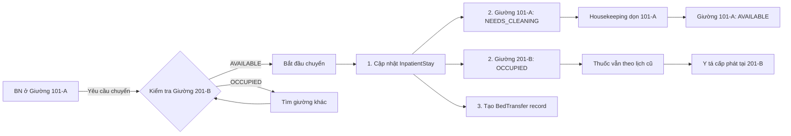
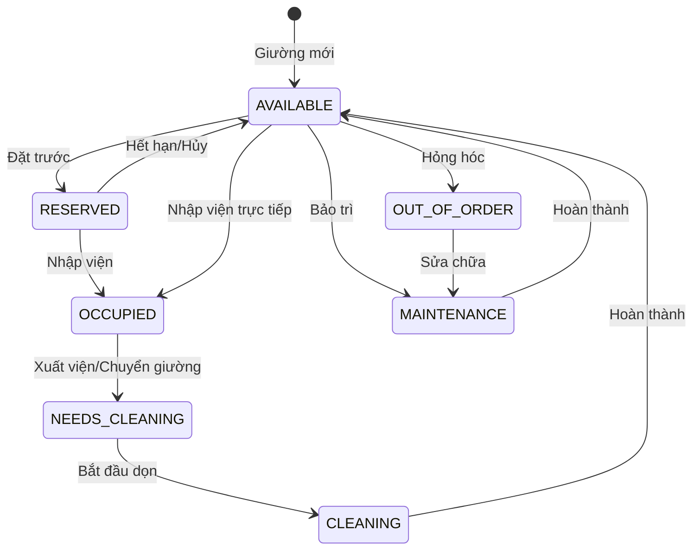
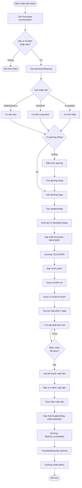
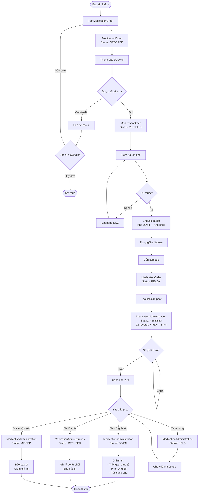
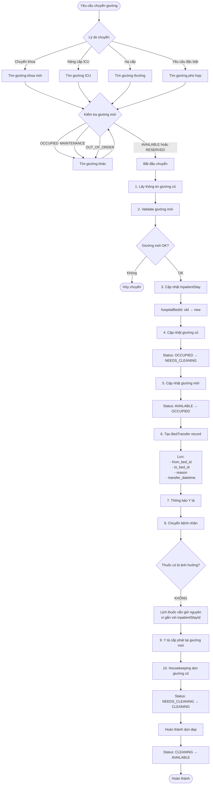

# 🏥 LUỒNG NỘI TRÚ VÀ PHÂN HỆ THUỐC - PHÂN TÍCH CHI TIẾT

**Ngày phân tích:** 2025-11-20  
**Database:** PostgreSQL (Docker Compose)  
**Phân tích bởi:** Augment Agent

---

## 📋 MỤC LỤC

1. [Tổng quan luồng nội trú](#1-tổng-quan-luồng-nội-trú)
2. [Vòng đời thuốc hàng ngày](#2-vòng-đời-thuốc-hàng-ngày)
3. [Quy trình chuyển giường](#3-quy-trình-chuyển-giường)
4. [Database Schema](#4-database-schema)
5. [Entity Relationships](#5-entity-relationships)
6. [Workflow Diagrams](#6-workflow-diagrams)

---

## 1. TỔNG QUAN LUỒNG NỘI TRÚ

### 1.1. Quy trình nhập viện đầy đủ



### 1.2. Trạng thái InpatientStay

| Trạng thái | Mô tả | Hành động được phép |
|-----------|-------|---------------------|
| **ACTIVE** | Đang điều trị nội trú | Kê y lệnh, cấp phát thuốc, chuyển giường |
| **DISCHARGED** | Đã xuất viện | Chỉ xem thông tin |
| **TRANSFERRED** | Đã chuyển viện | Chỉ xem thông tin |

### 1.3. Workflow 11 bước (InpatientWorkflowStep)

1. ✅ **Pre-Admission Assessment** - Đánh giá trước nhập viện
2. ✅ **Admission Orders** - Y lệnh nhập viện
3. ✅ **Nursing Assessment** - Đánh giá điều dưỡng
4. ✅ **Medication Reconciliation** - Đối chiếu thuốc
5. ✅ **Care Plan Development** - Lập kế hoạch chăm sóc
6. ✅ **Daily Rounds** - Thăm khám hàng ngày
7. ✅ **Medication Administration** - Cấp phát thuốc
8. ✅ **Vital Signs Monitoring** - Theo dõi sinh hiệu
9. ✅ **Discharge Planning** - Lập kế hoạch xuất viện
10. ✅ **Discharge Orders** - Y lệnh xuất viện
11. ✅ **Discharge Execution** - Thực hiện xuất viện

---

## 2. VÒNG ĐỜI THUỐC HÀNG NGÀY

### 2.1. Hai entity riêng biệt - QUAN TRỌNG!

**⚠️ LƯU Ý:** Hệ thống sử dụng **2 entities riêng biệt**:

1. **MedicationOrder** - Y lệnh thuốc (Bác sĩ kê, Dược sĩ xử lý)
2. **MedicationAdministration** - Cấp phát thuốc (Y tá thực hiện)

```
MedicationOrder (Y lệnh)          MedicationAdministration (Cấp phát)
├─ Bác sĩ kê đơn                  ├─ Y tá thực hiện
├─ Dược sĩ kiểm tra, chuẩn bị     ├─ Ghi nhận từng lần uống thuốc
├─ Status: ORDERED → VERIFIED     ├─ Status: PENDING → GIVEN
│          → READY                │          → REFUSED/MISSED/HELD
└─ Một order → Nhiều lần cấp phát └─ Gắn với inpatientStayId
```

---

### 2.2. Quy trình đầy đủ từ kê đơn đến cấp phát



### 2.3. Workflow MedicationOrder (Y lệnh thuốc)

**Status của MedicationOrder:**



**Chi tiết từng bước:**

| Status | Người thực hiện | Hành động | Ghi chú |
|--------|----------------|-----------|---------|
| **ORDERED** | Bác sĩ | Kê đơn thuốc | Ghi rõ: dosage, route, frequency, duration |
| **VERIFIED** | Dược sĩ | Kiểm tra tương tác thuốc, dị ứng | Có thể từ chối nếu không an toàn |
| **READY** | Dược sĩ | Chuẩn bị thuốc, chuyển kho | Đóng gói unit-dose, gắn barcode |

---

### 2.4. Workflow MedicationAdministration (Cấp phát thuốc)

**Tạo lịch cấp phát:**

```java
// Sau khi MedicationOrder = READY
// Hệ thống tạo MedicationAdministration records
// Số ngày = durationDays từ y lệnh bác sĩ (KHÔNG hardcode!)
// Ví dụ: Thuốc uống 3 lần/ngày (TID) × durationDays = số records

// Ví dụ 1: Bác sĩ kê 3 ngày
durationDays = 3
→ 3 ngày × 3 lần/ngày = 9 records

// Ví dụ 2: Bác sĩ kê 7 ngày (mặc định)
durationDays = 7
→ 7 ngày × 3 lần/ngày = 21 records

// Ví dụ 3: Bác sĩ kê 14 ngày
durationDays = 14
→ 14 ngày × 3 lần/ngày = 42 records

Ngày 1:
  - 08:00 AM: PENDING (MedicationAdministration #1)
  - 14:00 PM: PENDING (MedicationAdministration #2)
  - 20:00 PM: PENDING (MedicationAdministration #3)

Ngày 2:
  - 08:00 AM: PENDING (MedicationAdministration #4)
  - 14:00 PM: PENDING (MedicationAdministration #5)
  - 20:00 PM: PENDING (MedicationAdministration #6)

... (tiếp tục đến ngày durationDays)
```

**Thời gian mặc định theo tần suất:**

| Tần suất | Mã | Thời gian cấp phát | Records/ngày |
|----------|----|--------------------|--------------|
| 1 lần/ngày | QD | 08:00 | 1 |
| 2 lần/ngày | BID | 08:00, 20:00 | 2 |
| 3 lần/ngày | TID | 08:00, 14:00, 20:00 | 3 |
| 4 lần/ngày | QID | 08:00, 12:00, 16:00, 20:00 | 4 |
| Mỗi 6 giờ | Q6H | 00:00, 06:00, 12:00, 18:00 | 4 |

**Status của MedicationAdministration:**



**Chi tiết từng trạng thái:**

| Trạng thái | Mô tả | Người thực hiện | Hành động |
|-----------|-------|----------------|-----------|
| **PENDING** | Chờ cấp phát | Hệ thống | Tự động tạo từ MedicationOrder |
| **GIVEN** | Đã cho thuốc | Y tá | Ghi nhận: thời gian, phản ứng BN, tác dụng phụ |
| **REFUSED** | BN từ chối | Y tá | Ghi lý do, báo bác sĩ ngay |
| **MISSED** | Bỏ lỡ (quá muộn) | Hệ thống | Tự động đánh dấu nếu quá 4h, báo bác sĩ |
| **HELD** | Tạm dừng | Bác sĩ/Y tá | Theo y lệnh bác sĩ (VD: BN nôn, không ăn được) |

---

### 2.5. Validation thời gian cấp phát

**Quy tắc nghiêm ngặt:**

```
Lịch dự kiến: 14:00
├─ Sớm nhất: 13:00 (-1 giờ)
├─ Đúng giờ: 14:00
├─ Muộn được: 18:00 (+4 giờ)
└─ Quá muộn: > 18:00 → Tự động MISSED
```

**Ví dụ thực tế:**

```bash
# ✅ ĐƯỢC PHÉP
Lịch: 14:00, Thực tế: 13:30 → OK (trong khoảng -1h)
Lịch: 14:00, Thực tế: 17:00 → OK (trong khoảng +4h)

# ❌ BỊ TỪ CHỐI
Lịch: 14:00, Thực tế: 12:30 → ERROR "Quá sớm"
Lịch: 14:00, Thực tế: 19:00 → AUTO MISSED "Quá muộn"
```

### 2.6. APIs quan trọng

#### **A. APIs cho MedicationOrder (Bác sĩ, Dược sĩ):**

```bash
# 1. Bác sĩ kê đơn
POST /api/v1/medication-orders
{
  "encounterId": 100,
  "inpatientStayId": 200,
  "medicineId": 10,
  "dosage": "500mg",
  "route": "ORAL",
  "frequency": "TID",
  "durationDays": 7,
  "orderType": "INPATIENT"
}
Response: { "medicationOrderId": 300, "status": "ORDERED" }

# 2. Dược sĩ kiểm tra
POST /api/v1/medication-orders/300/verify
{ "notes": "Checked - no drug interactions" }
Response: { "status": "VERIFIED" }

# 3. Dược sĩ chuẩn bị
POST /api/v1/medication-orders/300/prepare
{ "notes": "Prepared unit-dose packages" }
Response: { "status": "READY" }
```

#### **B. APIs cho MedicationAdministration (Y tá):**

```bash
# 1. Lấy danh sách thuốc sắp đến (30 phút tới)
GET /api/v1/medication-alerts/upcoming
Response:
[
  {
    "administrationId": 1001,
    "medicationOrderId": 300,
    "patientName": "Nguyễn Văn A",
    "bedNumber": "101-A",
    "medicineName": "Paracetamol 500mg",
    "scheduledDatetime": "2025-11-20T14:00:00",
    "administrationStatus": "PENDING"
  }
]

# 2. Y tá cấp phát thuốc
POST /api/v1/inpatient/medications/1001/administer
{
  "actualDatetime": "2025-11-20T14:05:00",
  "administrationNotes": "Patient took medication with water",
  "patientResponse": "Good, no complaints",
  "sideEffectsObserved": null
}
Response: { "administrationStatus": "GIVEN" }

# 3. Bệnh nhân từ chối
POST /api/v1/inpatient/medications/1001/refuse
{
  "reasonNotGiven": "Patient feeling nauseous"
}
Response: { "administrationStatus": "REFUSED" }

# 4. Lấy lịch sử thuốc của bệnh nhân
GET /api/v1/inpatient/stays/200/medications
Response: [
  {
    "medicationOrderId": 300,
    "medicineName": "Paracetamol 500mg",
    "orderStatus": "READY",
    "administrations": [
      { "administrationId": 1001, "scheduledDatetime": "...", "status": "GIVEN" },
      { "administrationId": 1002, "scheduledDatetime": "...", "status": "PENDING" }
    ]
  }
]
```

---

### 2.7. Implementation Details (Code mới - 2025-11-20)

#### **A. Service Methods:**

**1. scheduleMedicationsFromOrder() - NEW INPATIENT FLOW ⭐**

```java
/**
 * Tạo lịch cấp phát từ MedicationOrder (luồng nội trú mới)
 * Sử dụng durationDays từ y lệnh bác sĩ
 */
@Transactional
public List<MedicationAdministrationResponse> scheduleMedicationsFromOrder(
        Integer inpatientStayId,
        Integer medicationOrderId) {

    // 1. Lấy MedicationOrder
    MedicationOrder medicationOrder = medicationOrderRepository.findById(medicationOrderId)
            .orElseThrow(() -> new ResourceNotFoundException(...));

    // 2. Validate status = READY
    if (!"READY".equals(medicationOrder.getStatus())) {
        throw new BusinessException("Only READY orders can be scheduled");
    }

    // 3. Lấy durationDays từ bác sĩ (KHÔNG hardcode!)
    Integer durationDays = medicationOrder.getDurationDays();

    // 4. Parse frequency → administration times
    LocalTime[] times = parseFrequencyToTimes(medicationOrder.getFrequency());

    // 5. Tạo lịch
    List<MedicationAdministration> schedules = createMedicationScheduleFromOrder(
        inpatientStayId, medicationOrder, times, durationDays
    );

    // 6. Lưu database
    return medicationAdministrationRepository.saveAll(schedules);
}
```

**2. parseFrequencyToTimes() - Helper Method ⭐**

```java
/**
 * Chuyển đổi mã tần suất → thời gian cấp phát
 * Hỗ trợ: QD, BID, TID, QID, Q4H, Q6H, Q8H, Q12H
 */
private LocalTime[] parseFrequencyToTimes(String frequency) {
    return switch (frequency.toUpperCase()) {
        case "QD", "DAILY" -> new LocalTime[]{
            LocalTime.of(8, 0)  // 8:00 AM
        };
        case "BID" -> new LocalTime[]{
            LocalTime.of(8, 0),   // 8:00 AM
            LocalTime.of(20, 0)   // 8:00 PM
        };
        case "TID" -> new LocalTime[]{
            LocalTime.of(8, 0),   // 8:00 AM
            LocalTime.of(14, 0),  // 2:00 PM
            LocalTime.of(20, 0)   // 8:00 PM
        };
        case "QID" -> new LocalTime[]{
            LocalTime.of(8, 0),   // 8:00 AM
            LocalTime.of(12, 0),  // 12:00 PM
            LocalTime.of(16, 0),  // 4:00 PM
            LocalTime.of(20, 0)   // 8:00 PM
        };
        case "Q4H" -> new LocalTime[]{
            LocalTime.of(0, 0), LocalTime.of(4, 0),
            LocalTime.of(8, 0), LocalTime.of(12, 0),
            LocalTime.of(16, 0), LocalTime.of(20, 0)
        };
        case "Q6H" -> new LocalTime[]{
            LocalTime.of(0, 0), LocalTime.of(6, 0),
            LocalTime.of(12, 0), LocalTime.of(18, 0)
        };
        case "Q8H" -> new LocalTime[]{
            LocalTime.of(0, 0), LocalTime.of(8, 0), LocalTime.of(16, 0)
        };
        case "Q12H" -> new LocalTime[]{
            LocalTime.of(8, 0), LocalTime.of(20, 0)
        };
        default -> {
            log.warn("Unknown frequency: {}, defaulting to TID", frequency);
            yield new LocalTime[]{
                LocalTime.of(8, 0), LocalTime.of(14, 0), LocalTime.of(20, 0)
            };
        }
    };
}
```

**3. createMedicationScheduleFromOrder() - Core Logic ⭐**

```java
/**
 * Tạo MedicationAdministration records từ MedicationOrder
 * Sử dụng durationDays từ bác sĩ (1-365 ngày)
 */
private List<MedicationAdministration> createMedicationScheduleFromOrder(
        Integer inpatientStayId,
        MedicationOrder medicationOrder,
        LocalTime[] administrationTimes,
        Integer durationDays) {

    List<MedicationAdministration> schedules = new ArrayList<>();

    // Sử dụng durationDays từ bác sĩ, default 7 nếu null
    int days = (durationDays != null && durationDays > 0) ? durationDays : 7;

    log.debug("Creating schedule for {} days with {} times/day",
        days, administrationTimes.length);

    LocalDateTime startDate = LocalDateTime.now()
        .withHour(0).withMinute(0).withSecond(0);

    // Tạo lịch cho từng ngày
    for (int day = 0; day < days; day++) {
        LocalDateTime currentDate = startDate.plusDays(day);

        // Tạo lịch cho từng lần trong ngày
        for (LocalTime time : administrationTimes) {
            LocalDateTime scheduledDateTime = currentDate.with(time);

            // Chỉ tạo lịch cho tương lai
            if (scheduledDateTime.isAfter(LocalDateTime.now())) {
                MedicationAdministration administration =
                    MedicationAdministration.builder()
                        .medicationOrderId(medicationOrder.getId())
                        .inpatientStayId(inpatientStayId)
                        .scheduledDatetime(scheduledDateTime)
                        .administrationStatus(AdministrationStatus.PENDING)
                        .build();

                schedules.add(administration);
            }
        }
    }

    log.debug("Created {} administration records", schedules.size());
    return schedules;
}
```

#### **B. Ví dụ sử dụng:**

```java
// Ví dụ 1: Thuốc ngắn hạn (3 ngày)
MedicationOrder order1 = MedicationOrder.builder()
    .frequency("TID")        // 3 lần/ngày
    .durationDays(3)         // 3 ngày
    .build();
// → Tạo 9 records (3 × 3)

// Ví dụ 2: Thuốc dài hạn (14 ngày)
MedicationOrder order2 = MedicationOrder.builder()
    .frequency("BID")        // 2 lần/ngày
    .durationDays(14)        // 14 ngày
    .build();
// → Tạo 28 records (14 × 2)

// Ví dụ 3: Không nhập duration (default 7)
MedicationOrder order3 = MedicationOrder.builder()
    .frequency("QD")         // 1 lần/ngày
    .durationDays(null)      // null → default 7
    .build();
// → Tạo 7 records (7 × 1)
```

---

## 3. QUY TRÌNH CHUYỂN GIƯỜNG

### 3.1. Khi nào cần chuyển giường?

1. **Chuyển khoa điều trị**
   - Ví dụ: Nội khoa → Ngoại khoa (cần phẫu thuật)
   
2. **Nâng/hạ cấp độ chăm sóc**
   - Ví dụ: Phòng thường → ICU (bệnh nặng)
   - Ví dụ: ICU → Phòng thường (hồi phục)

3. **Yêu cầu đặc biệt**
   - Cách ly (isolation)
   - Giường VIP (theo yêu cầu gia đình)
   - Giường gần cửa sổ (tâm lý BN)

### 3.2. Quy trình chuyển giường chi tiết



### 3.3. ❓ Thuốc có bị ảnh hưởng khi chuyển giường?

**✅ Trả lời: KHÔNG bị ảnh hưởng**

**Lý do thiết kế:**

```java
// MedicationAdministration gắn với inpatientStayId
// KHÔNG gắn với bedId

@Entity
public class MedicationAdministration {
    @Column(name = "inpatient_stay_id", nullable = false)
    private Integer inpatientStayId;  // ← Gắn với stay

    @Column(name = "medication_order_id")
    private Integer medicationOrderId;  // ← Link đến y lệnh

    // KHÔNG CÓ bedId ở đây!
}
```

**Ví dụ thực tế:**

```
Bệnh nhân: Nguyễn Văn A
InpatientStay ID: 100
MedicationOrder ID: 300 (Paracetamol 500mg, TID × 7 ngày)

Lịch thuốc (MedicationAdministration):
- 08:00: Admin #1001 (inpatientStayId=100, medicationOrderId=300, status=GIVEN)
- 14:00: Admin #1002 (inpatientStayId=100, medicationOrderId=300, status=PENDING)
- 20:00: Admin #1003 (inpatientStayId=100, medicationOrderId=300, status=PENDING)

10:00 - Chuyển giường: 101-A → 201-B
  ├─ InpatientStay.hospitalBedId: 101 → 201
  ├─ Giường 101-A: OCCUPIED → NEEDS_CLEANING
  ├─ Giường 201-B: AVAILABLE → OCCUPIED
  ├─ MedicationOrder #300: KHÔNG THAY ĐỔI (vẫn READY)
  └─ MedicationAdministration #1002, #1003: KHÔNG THAY ĐỔI (vẫn PENDING)

14:00 - Y tá cấp phát Paracetamol tại giường 201-B
  ├─ Tìm BN qua: InpatientStay.hospitalBedId = 201
  ├─ Lấy MedicationAdministration #1002 (inpatientStayId=100)
  └─ Cập nhật: status = GIVEN, actualDatetime = 14:05
```

### 3.4. API chuyển giường

```bash
POST /api/v1/inpatient/stays/100/transfer-bed
{
  "newBedId": 201,
  "reason": "Chuyển lên ICU do bệnh nặng",
  "approvedByEmployeeId": 5
}

Response:
{
  "inpatientStayId": 100,
  "oldBedNumber": "101-A",
  "newBedNumber": "201-B",
  "transferDatetime": "2025-11-20T10:00:00",
  "reason": "Chuyển lên ICU do bệnh nặng"
}
```

---

## 4. DATABASE SCHEMA

### 4.1. Bảng InpatientStays

```sql
Table "public.InpatientStays"
Column                      | Type                        | Nullable | Default
----------------------------+-----------------------------+----------+------------------
inpatient_stay_id           | integer                     | NOT NULL | IDENTITY
encounter_id                | integer                     | NOT NULL |
hospital_bed_id             | integer                     |          |
admission_date              | timestamp                   | NOT NULL |
discharge_date              | timestamp                   |          |
admission_diagnosis         | text                        |          |
attending_doctor_id         | integer                     |          |
admission_type              | varchar(20)                 |          | 'PLANNED'
current_status              | varchar(20)                 |          | 'ACTIVE'
pre_admission_completed     | boolean                     |          | false
admission_orders_completed  | boolean                     |          | false
discharge_planning_initiated| boolean                     |          | false
discharge_ready             | boolean                     |          | false
disposition_type            | varchar(50)                 |          |
discharge_ordered           | boolean                     |          | false
discharge_ordered_at        | timestamp                   |          |
discharge_ordered_by_employee_id | integer                |          |
created_at                  | timestamp                   |          | CURRENT_TIMESTAMP
updated_at                  | timestamp                   |          |
deleted_at                  | timestamp                   |          |
created_by_employee_id      | integer                     |          |
updated_by_employee_id      | integer                     |          |

Indexes:
  - PRIMARY KEY (inpatient_stay_id)
  - idx_inpatient_stays_deleted_at (deleted_at)

Foreign Keys:
  - encounter_id → Encounters(encounter_id)
  - hospital_bed_id → HospitalBeds(hospital_bed_id)
  - attending_doctor_id → Employees(employee_id)
```

### 4.2. Bảng MedicationAdministration

```sql
Table "public.MedicationAdministration"
Column                   | Type                        | Nullable | Default
-------------------------+-----------------------------+----------+------------------
administration_id        | integer                     | NOT NULL | SEQUENCE
prescription_item_id     | integer                     |          |
medication_order_id      | integer                     |          |
inpatient_stay_id        | integer                     | NOT NULL |
scheduled_datetime       | timestamp                   |          |
actual_datetime          | timestamp                   |          |
administered_by_nurse_id | integer                     |          |
administration_status    | varchar(20)                 |          | 'PENDING'
administration_notes     | text                        |          |
patient_response         | text                        |          |
side_effects_observed    | text                        |          |
created_at               | timestamp                   |          | CURRENT_TIMESTAMP
updated_at               | timestamp                   |          |
deleted_at               | timestamp                   |          |
created_by_employee_id   | integer                     |          |
updated_by_employee_id   | integer                     |          |
version                  | integer                     |          | 0

Indexes:
  - PRIMARY KEY (administration_id)
  - IDX_MedicationAdmin_InpatientStay (inpatient_stay_id)
  - IDX_MedicationAdmin_Scheduled (scheduled_datetime)
  - IDX_MedicationAdmin_Status (administration_status)
  - IDX_MedicationAdmin_Nurse (administered_by_nurse_id)
  - idx_medication_administration_deleted_at (deleted_at)

Foreign Keys:
  - inpatient_stay_id → InpatientStays(inpatient_stay_id)
  - prescription_item_id → PrescriptionItems(prescription_item_id)
  - medication_order_id → MedicationOrders(medication_order_id) ON DELETE CASCADE
  - administered_by_nurse_id → Employees(employee_id)

Check Constraints:
  - administration_status IN ('PENDING', 'GIVEN', 'REFUSED', 'MISSED', 'HELD')
  - chk_medication_administration_source:
    (prescription_item_id IS NOT NULL AND medication_order_id IS NULL) OR
    (prescription_item_id IS NULL AND medication_order_id IS NOT NULL)
```

### 4.3. Bảng BedTransfers

```sql
Table "public.BedTransfers"
Column                  | Type                        | Nullable | Default
------------------------+-----------------------------+----------+------------------
bed_transfer_id         | integer                     | NOT NULL | IDENTITY
inpatient_stay_id       | integer                     | NOT NULL |
from_bed_id             | integer                     |          |
to_bed_id               | integer                     | NOT NULL |
transfer_datetime       | timestamp                   | NOT NULL |
reason                  | text                        |          |
approved_by_employee_id | integer                     |          |
created_at              | timestamp                   |          | CURRENT_TIMESTAMP
updated_at              | timestamp                   |          |
deleted_at              | timestamp                   |          |
created_by_employee_id  | integer                     |          |
updated_by_employee_id  | integer                     |          |

Indexes:
  - PRIMARY KEY (bed_transfer_id)
  - idx_bedtransfers_deleted_at (deleted_at)

Foreign Keys:
  - inpatient_stay_id → InpatientStays(inpatient_stay_id)
  - from_bed_id → HospitalBeds(hospital_bed_id)
  - to_bed_id → HospitalBeds(hospital_bed_id)
  - approved_by_employee_id → Employees(employee_id)
```

### 4.4. Bảng HospitalBeds

```sql
Table "public.HospitalBeds"
Column                 | Type                        | Nullable | Default
-----------------------+-----------------------------+----------+------------------
hospital_bed_id        | integer                     | NOT NULL | IDENTITY
patient_room_id        | integer                     | NOT NULL |
bed_number             | varchar(50)                 | NOT NULL |
status                 | varchar(50)                 | NOT NULL |
type                   | varchar(100)                |          |
bed_type               | varchar(50)                 |          | 'STANDARD'
gender_restriction     | varchar(10)                 |          |
isolation_capable      | boolean                     |          | false
monitoring_level       | varchar(20)                 |          | 'BASIC'
reserved_until         | timestamp                   |          |
cleaned_at             | timestamp                   |          |
created_at             | timestamp                   |          | CURRENT_TIMESTAMP
updated_at             | timestamp                   |          |
deleted_at             | timestamp                   |          |
created_by_employee_id | integer                     |          |
updated_by_employee_id | integer                     |          |

Indexes:
  - PRIMARY KEY (hospital_bed_id)
  - idx_hospitalbeds_deleted_at (deleted_at)
  - idx_hospitalbeds_needs_cleaning (status, cleaned_at)
    WHERE status IN ('NEEDS_CLEANING', 'CLEANING') AND deleted_at IS NULL
  - idx_hospitalbeds_reserved_until (reserved_until)
    WHERE status = 'RESERVED' AND deleted_at IS NULL
  - idx_occupied_bed UNIQUE (hospital_bed_id)
    WHERE status = 'OCCUPIED' AND deleted_at IS NULL

Check Constraints:
  - status IN ('AVAILABLE', 'OCCUPIED', 'MAINTENANCE', 'RESERVED',
               'NEEDS_CLEANING', 'CLEANING', 'OUT_OF_ORDER')

Foreign Keys:
  - patient_room_id → PatientRooms(patient_room_id)
```

**Trạng thái giường (BedStatus):**



### 4.5. Bảng MedicationOrders

```sql
Table "public.MedicationOrders"
Column                       | Type                        | Nullable | Default
-----------------------------+-----------------------------+----------+------------------
medication_order_id          | integer                     | NOT NULL | SEQUENCE
encounter_id                 | integer                     | NOT NULL |
inpatient_stay_id            | integer                     |          |
patient_id                   | integer                     | NOT NULL |
prescription_id              | integer                     |          |
medicine_id                  | integer                     | NOT NULL |
dosage                       | varchar(255)                | NOT NULL |
route                        | varchar(100)                | NOT NULL |
frequency                    | varchar(100)                | NOT NULL |
duration_days                | integer                     |          |
special_instructions         | text                        |          |
order_type                   | varchar(20)                 | NOT NULL |
status                       | varchar(20)                 | NOT NULL | 'ORDERED'
priority                     | varchar(20)                 |          | 'ROUTINE'
is_prn                       | boolean                     |          | false
is_stat                      | boolean                     |          | false
is_discontinued              | boolean                     |          | false
ordered_by_doctor_id         | integer                     | NOT NULL |
ordered_at                   | timestamp                   |          | CURRENT_TIMESTAMP
verified_by_pharmacist_id    | integer                     |          |
verified_at                  | timestamp                   |          |
prepared_by_pharmacist_id    | integer                     |          |
prepared_at                  | timestamp                   |          |
administered_by_nurse_id     | integer                     |          |
administered_datetime        | timestamp                   |          |
created_at                   | timestamp                   |          | CURRENT_TIMESTAMP
updated_at                   | timestamp                   |          |
deleted_at                   | timestamp                   |          |

Indexes:
  - PRIMARY KEY (medication_order_id)
  - idx_medication_orders_encounter_id (encounter_id)
  - idx_medication_orders_inpatient_stay_id (inpatient_stay_id)
  - idx_medication_orders_patient_id (patient_id)
  - idx_medication_orders_status (status)
  - idx_medication_orders_is_prn (is_prn) WHERE is_prn = true
  - idx_medication_orders_is_stat (is_stat) WHERE is_stat = true

Foreign Keys:
  - encounter_id → Encounters(encounter_id)
  - inpatient_stay_id → InpatientStays(inpatient_stay_id)
  - patient_id → Patients(patient_id)
  - medicine_id → Medicines(medicine_id)
  - ordered_by_doctor_id → Employees(employee_id)
```

**Trạng thái MedicationOrder:**

```
ORDERED → VERIFIED → READY
  ↓          ↓         ↓
Bác sĩ    Dược sĩ   Dược sĩ
kê đơn    kiểm tra  chuẩn bị
```

**⚠️ LƯU Ý:** MedicationOrder KHÔNG có status "ADMINISTERED"!
"ADMINISTERED" là status của **MedicationAdministration** (entity riêng biệt).

---

## 5. ENTITY RELATIONSHIPS

### 5.1. Sơ đồ quan hệ tổng thể

```
Patient (1) ──────── (N) Encounter
                          │
                          ├── (1) InpatientStay
                          │        │
                          │        ├── (1) HospitalBed
                          │        │        │
                          │        │        └── (1) PatientRoom
                          │        │
                          │        ├── (N) MedicationAdministration
                          │        │        │
                          │        │        ├── (1) PrescriptionItem
                          │        │        │        │
                          │        │        │        └── (1) Medicine
                          │        │        │
                          │        │        └── (1) MedicationOrder
                          │        │                 │
                          │        │                 └── (1) Medicine
                          │        │
                          │        ├── (N) BedTransfer
                          │        │        │
                          │        │        ├── (1) HospitalBed (from)
                          │        │        └── (1) HospitalBed (to)
                          │        │
                          │        ├── (N) InpatientWorkflowStepInstance
                          │        │
                          │        ├── (N) NursingNote
                          │        │
                          │        └── (0..1) DischargePlanning
                          │
                          └── (N) MedicationOrder
```

### 5.2. Quan hệ quan trọng

**1. InpatientStay ← MedicationAdministration (2 nguồn)**

```java
// Thuốc gắn với stay, KHÔNG gắn với bed
@Entity
public class MedicationAdministration {
    @Column(name = "inpatient_stay_id", nullable = false)
    private Integer inpatientStayId;  // ← CRITICAL

    // 2 nguồn (chỉ 1 trong 2 có giá trị):
    @Column(name = "prescription_item_id")  // Legacy - ngoại trú
    private Integer prescriptionItemId;

    @Column(name = "medication_order_id")  // New - nội trú
    private Integer medicationOrderId;

    // KHÔNG CÓ bedId!
}
```

**Lợi ích:**
- ✅ Chuyển giường không ảnh hưởng lịch thuốc
- ✅ Lịch sử thuốc đầy đủ theo đợt nội trú
- ✅ Dễ dàng truy vấn tất cả thuốc của 1 stay
- ✅ Hỗ trợ cả 2 nguồn: PrescriptionItem (cũ) và MedicationOrder (mới)

**2. InpatientStay → MedicationOrder**

```java
@Entity
public class MedicationOrder {
    @Column(name = "inpatient_stay_id")
    private Integer inpatientStayId;  // Y lệnh cho nội trú

    @Column(name = "status")
    private String status;  // ORDERED → VERIFIED → READY
}
```

**Lợi ích:**
- ✅ Một MedicationOrder → Nhiều MedicationAdministration
- ✅ Workflow rõ ràng: Bác sĩ kê → Dược sĩ xử lý → Y tá cấp phát
- ✅ Audit trail đầy đủ

**3. InpatientStay → HospitalBed**

```java
@Entity
public class InpatientStay {
    @Column(name = "hospital_bed_id")
    private Integer hospitalBedId;  // Có thể thay đổi khi chuyển giường
}
```

**3. BedTransfer → InpatientStay**

```java
@Entity
public class BedTransfer {
    @Column(name = "inpatient_stay_id", nullable = false)
    private Integer inpatientStayId;

    @Column(name = "from_bed_id")
    private Integer fromBedId;

    @Column(name = "to_bed_id", nullable = false)
    private Integer toBedId;
}
```

**Lịch sử chuyển giường:**
```sql
SELECT
    bt.transfer_datetime,
    fb.bed_number AS from_bed,
    tb.bed_number AS to_bed,
    bt.reason
FROM "BedTransfers" bt
LEFT JOIN "HospitalBeds" fb ON bt.from_bed_id = fb.hospital_bed_id
JOIN "HospitalBeds" tb ON bt.to_bed_id = tb.hospital_bed_id
WHERE bt.inpatient_stay_id = 100
ORDER BY bt.transfer_datetime;
```

---

## 6. WORKFLOW DIAGRAMS

### 6.1. Luồng nhập viện đầy đủ



### 6.2. Vòng đời thuốc chi tiết



### 6.3. Quy trình chuyển giường chi tiết



---

## 7. SCHEDULED JOBS (Công việc tự động)

### 7.1. Medication Alerts (Cảnh báo thuốc)

**Chạy mỗi 5 phút:**

```java
@Scheduled(cron = "0 */5 * * * *")
public void checkUpcomingMedications() {
    // Tìm thuốc sắp đến (30 phút tới)
    LocalDateTime now = LocalDateTime.now();
    LocalDateTime upcoming = now.plusMinutes(30);

    List<MedicationAdministration> upcomingMeds =
        medicationAdministrationRepository.findByScheduledDatetimeBetweenAndStatus(
            now, upcoming, AdministrationStatus.PENDING
        );

    // Gửi thông báo cho y tá
    for (MedicationAdministration med : upcomingMeds) {
        notificationService.notifyNurse(med);
    }
}

@Scheduled(cron = "0 */5 * * * *")
public void checkOverdueMedications() {
    // Tìm thuốc quá hạn (> 30 phút)
    LocalDateTime overdue = LocalDateTime.now().minusMinutes(30);

    List<MedicationAdministration> overdueMeds =
        medicationAdministrationRepository.findByScheduledDatetimeBeforeAndStatus(
            overdue, AdministrationStatus.PENDING
        );

    // Gửi cảnh báo khẩn cấp
    for (MedicationAdministration med : overdueMeds) {
        alertService.sendUrgentAlert(med);
    }
}

@Scheduled(cron = "0 0 */4 * * *")  // Mỗi 4 giờ
public void autoMarkMissedMedications() {
    // Tự động đánh dấu MISSED nếu quá 4 giờ
    LocalDateTime missedThreshold = LocalDateTime.now().minusHours(4);

    List<MedicationAdministration> missedMeds =
        medicationAdministrationRepository.findByScheduledDatetimeBeforeAndStatus(
            missedThreshold, AdministrationStatus.PENDING
        );

    for (MedicationAdministration med : missedMeds) {
        med.markAsMissed("Auto-marked: exceeded 4-hour window");
        medicationAdministrationRepository.save(med);

        // Thông báo bác sĩ
        notificationService.notifyDoctor(med);
    }
}
```

### 7.2. Bed Reservation Expiry (Hết hạn đặt giường)

**Chạy mỗi 5 phút:**

```java
@Scheduled(cron = "0 */5 * * * *")
public void autoExpireReservations() {
    LocalDateTime now = LocalDateTime.now();

    // Tìm giường đặt trước đã hết hạn
    List<HospitalBed> expiredBeds =
        hospitalBedRepository.findByStatusAndReservedUntilBefore(
            BedStatus.RESERVED, now
        );

    for (HospitalBed bed : expiredBeds) {
        bed.unreserve();  // RESERVED → AVAILABLE
        hospitalBedRepository.save(bed);

        log.info("Auto-unreserved bed: {}", bed.getBedNumber());
    }
}
```

### 7.3. Stock Alerts (Cảnh báo tồn kho)

**Chạy mỗi ngày 6:00 AM:**

```java
@Scheduled(cron = "0 0 6 * * *")
public void generateLowStockAlerts() {
    // Kiểm tra thuốc sắp hết trong kho khoa
    List<InventoryStock> lowStockItems =
        inventoryStockRepository.findLowStockItems();

    for (InventoryStock stock : lowStockItems) {
        StockAlert alert = StockAlert.builder()
            .medicineId(stock.getMedicineId())
            .cabinetId(stock.getCabinetId())
            .currentQuantity(stock.getQuantity())
            .minimumQuantity(stock.getMinimumQuantity())
            .severity(AlertSeverity.WARNING)
            .build();

        stockAlertRepository.save(alert);

        // Thông báo dược sĩ
        notificationService.notifyPharmacist(alert);
    }
}
```

### 7.4. Discharge Planning Reminders

**Chạy mỗi ngày 8:00 AM:**

```java
@Scheduled(cron = "0 0 8 * * *")
public void checkDischargePlanningStatus() {
    // Tìm BN nội trú > 3 ngày chưa có kế hoạch xuất viện
    LocalDateTime threeDaysAgo = LocalDateTime.now().minusDays(3);

    List<InpatientStay> staysNeedingPlanning =
        inpatientStayRepository.findByAdmissionDateBeforeAndDischargePlanningInitiatedFalse(
            threeDaysAgo
        );

    for (InpatientStay stay : staysNeedingPlanning) {
        // Thông báo bác sĩ điều trị
        notificationService.notifyAttendingDoctor(stay);
    }
}
```

---

## 8. SECURITY & PERMISSIONS

### 8.1. Phân quyền theo vai trò

| Hành động | Permission | Vai trò |
|-----------|-----------|---------|
| Nhập viện | `inpatient.admit` | Doctor, Admin |
| Kê y lệnh | `medication.order` | Doctor |
| Kiểm tra y lệnh | `medication.verify` | Pharmacist |
| Chuẩn bị thuốc | `medication.prepare` | Pharmacist |
| Cấp phát thuốc | `medication.administer` | Nurse |
| Chuyển giường | `bed.transfer` | Nurse, Doctor, Admin |
| Xuất viện | `inpatient.discharge` | Doctor, Admin |
| Xem lịch sử thuốc | `medication.view` | Doctor, Nurse, Pharmacist |
| Quản lý giường | `bed.manage` | Admin, Nurse Manager |

### 8.2. Audit Trail (Nhật ký kiểm toán)

**Tất cả thao tác được ghi log:**

```java
// Mọi entity đều có audit fields
@Column(name = "created_by_employee_id")
private Integer createdByEmployeeId;

@Column(name = "updated_by_employee_id")
private Integer updatedByEmployeeId;

@CreationTimestamp
@Column(name = "created_at")
private LocalDateTime createdAt;

@UpdateTimestamp
@Column(name = "updated_at")
private LocalDateTime updatedAt;
```

**Ví dụ truy vấn audit:**

```sql
-- Lịch sử cấp phát thuốc của 1 bệnh nhân
SELECT
    ma.scheduled_datetime,
    ma.actual_datetime,
    ma.administration_status,
    m.medicine_name,
    e.full_name AS nurse_name,
    ma.patient_response,
    ma.created_at
FROM "MedicationAdministration" ma
JOIN "PrescriptionItems" pi ON ma.prescription_item_id = pi.prescription_item_id
JOIN "Medicines" m ON pi.medicine_id = m.medicine_id
LEFT JOIN "Employees" e ON ma.administered_by_nurse_id = e.employee_id
WHERE ma.inpatient_stay_id = 100
ORDER BY ma.scheduled_datetime;

-- Lịch sử chuyển giường
SELECT
    bt.transfer_datetime,
    fb.bed_number AS from_bed,
    tb.bed_number AS to_bed,
    bt.reason,
    e.full_name AS approved_by
FROM "BedTransfers" bt
LEFT JOIN "HospitalBeds" fb ON bt.from_bed_id = fb.hospital_bed_id
JOIN "HospitalBeds" tb ON bt.to_bed_id = tb.hospital_bed_id
LEFT JOIN "Employees" e ON bt.approved_by_employee_id = e.employee_id
WHERE bt.inpatient_stay_id = 100
ORDER BY bt.transfer_datetime;
```

---

## 9. PERFORMANCE OPTIMIZATION

### 9.1. Database Indexes

**Indexes quan trọng đã có:**

```sql
-- MedicationAdministration
CREATE INDEX IDX_MedicationAdmin_InpatientStay ON "MedicationAdministration"(inpatient_stay_id);
CREATE INDEX IDX_MedicationAdmin_Scheduled ON "MedicationAdministration"(scheduled_datetime);
CREATE INDEX IDX_MedicationAdmin_Status ON "MedicationAdministration"(administration_status);
CREATE INDEX idx_medication_administration_deleted_at ON "MedicationAdministration"(deleted_at);

-- InpatientStays
CREATE INDEX idx_inpatient_stays_deleted_at ON "InpatientStays"(deleted_at);

-- HospitalBeds
CREATE INDEX idx_hospitalbeds_needs_cleaning ON "HospitalBeds"(status, cleaned_at)
  WHERE status IN ('NEEDS_CLEANING', 'CLEANING') AND deleted_at IS NULL;

CREATE INDEX idx_hospitalbeds_reserved_until ON "HospitalBeds"(reserved_until)
  WHERE status = 'RESERVED' AND deleted_at IS NULL;

CREATE UNIQUE INDEX idx_occupied_bed ON "HospitalBeds"(hospital_bed_id)
  WHERE status = 'OCCUPIED' AND deleted_at IS NULL;

-- BedTransfers
CREATE INDEX idx_bedtransfers_deleted_at ON "BedTransfers"(deleted_at);
```

### 9.2. Query Optimization

**❌ BAD - N+1 Query Problem:**

```java
List<InpatientStay> stays = inpatientStayRepository.findAll();
for (InpatientStay stay : stays) {
    HospitalBed bed = stay.getHospitalBed();  // Lazy load - N queries
    System.out.println(bed.getBedNumber());
}
```

**✅ GOOD - JOIN FETCH:**

```java
@Query("SELECT s FROM InpatientStay s " +
       "LEFT JOIN FETCH s.hospitalBed " +
       "LEFT JOIN FETCH s.encounter " +
       "WHERE s.currentStatus = 'ACTIVE' AND s.deletedAt IS NULL")
List<InpatientStay> findActiveStaysWithDetails();
```

### 9.3. Caching Strategy

**Redis cache cho:**

- ✅ Danh sách giường available (TTL: 1 phút)
- ✅ Workflow steps (TTL: 5 phút)
- ✅ Medication schedules hôm nay (TTL: 1 giờ)
- ✅ Medicine information (TTL: 1 ngày)

**Không cache:**

- ❌ Medication administration status (real-time)
- ❌ Bed occupancy (real-time)
- ❌ Patient vital signs (real-time)

---

## 10. TESTING SCENARIOS

### 10.1. Test Case: Nhập viện thành công

```bash
# 1. Tạo encounter
POST /api/v1/encounters
{
  "patientId": 1,
  "encounterType": "OUTPATIENT",
  "chiefComplaint": "Đau bụng dữ dội"
}
Response: { "encounterId": 100 }

# 2. Nhập viện
POST /api/v1/inpatient/encounters/100/admit
{
  "admissionDate": "2025-11-20T10:00:00",
  "admissionDiagnosis": "Viêm ruột thừa cấp",
  "attendingDoctorId": 5,
  "preferredBedId": 101,
  "admissionType": "EMERGENCY"
}
Response: { "inpatientStayId": 200, "bedNumber": "101-A", "status": "ACTIVE" }

# 3. Verify
GET /api/v1/inpatient/stays/200
Expected:
- status = ACTIVE
- bedId = 101
- 11 workflow steps initialized
```

### 10.2. Test Case: Vòng đời thuốc đầy đủ

```bash
# 1. Bác sĩ kê đơn
POST /api/v1/medication-orders
{
  "encounterId": 100,
  "inpatientStayId": 200,
  "medicineId": 10,
  "dosage": "500mg",
  "route": "ORAL",
  "frequency": "TID",
  "durationDays": 7,
  "orderType": "INPATIENT"
}
Response: { "medicationOrderId": 300, "status": "ORDERED" }

# 2. Verify lịch tự động tạo
GET /api/v1/inpatient/stays/200/medications
Expected: 21 records (7 days × 3 times/day)
# ✅ Số records = durationDays × frequency per day

# 3. Dược sĩ kiểm tra
POST /api/v1/medication-orders/300/verify
{ "notes": "Checked - no drug interactions" }
Response: { "status": "VERIFIED" }

# 4. Dược sĩ chuẩn bị
POST /api/v1/medication-orders/300/prepare
{ "notes": "Prepared unit-dose packages" }
Response: { "status": "READY" }

# 5. Y tá cấp phát
POST /api/v1/inpatient/medications/1001/administer
{
  "actualDatetime": "2025-11-20T08:05:00",
  "administrationNotes": "Patient took medication with water",
  "patientResponse": "Good, no complaints"
}
Response: { "status": "GIVEN" }
```

### 10.3. Test Case: Chuyển giường

```bash
# 1. Kiểm tra giường hiện tại
GET /api/v1/inpatient/stays/200
Response: { "bedNumber": "101-A", "bedId": 101 }

# 2. Chuyển giường
POST /api/v1/inpatient/stays/200/transfer-bed
{
  "newBedId": 201,
  "reason": "Chuyển lên ICU do bệnh nặng",
  "approvedByEmployeeId": 5
}
Response: {
  "oldBedNumber": "101-A",
  "newBedNumber": "201-B",
  "transferDatetime": "2025-11-20T14:00:00"
}

# 3. Verify giường cũ
GET /api/v1/beds/101
Expected: { "status": "NEEDS_CLEANING" }

# 4. Verify giường mới
GET /api/v1/beds/201
Expected: { "status": "OCCUPIED" }

# 5. Verify lịch thuốc KHÔNG thay đổi
GET /api/v1/inpatient/stays/200/medications
Expected: Tất cả lịch vẫn giữ nguyên (vì gắn với stayId=200)
```

---

## 11. KẾT LUẬN

### 11.1. Điểm mạnh của thiết kế

✅ **Thuốc gắn với InpatientStay, không gắn với Bed**
- Chuyển giường không ảnh hưởng lịch thuốc
- Lịch sử đầy đủ theo đợt nội trú

✅ **Lịch cấp phát tự động 7 ngày**
- Giảm công việc thủ công
- Đảm bảo không bỏ sót

✅ **Validation thời gian nghiêm ngặt**
- Sớm nhất: -1 giờ
- Muộn nhất: +4 giờ
- Tự động MISSED nếu quá muộn

✅ **Audit trail đầy đủ**
- Ai làm gì, khi nào
- Truy vết được mọi thao tác

✅ **Workflow 11 bước chuẩn hóa**
- Đảm bảo chất lượng điều trị
- Tuân thủ quy trình y tế

### 11.2. Khuyến nghị cải tiến

🔧 **Thêm barcode scanning**
- Quét mã vạch thuốc
- Quét vòng tay bệnh nhân
- Giảm sai sót cấp phát

🔧 **Tích hợp CPOE (Computerized Physician Order Entry)**
- Bác sĩ kê đơn điện tử
- Kiểm tra tương tác thuốc tự động
- Cảnh báo dị ứng real-time

🔧 **Mobile app cho Y tá**
- Cấp phát thuốc tại giường
- Nhận cảnh báo push notification
- Ghi nhận nhanh hơn

🔧 **Dashboard theo dõi real-time**
- Tỷ lệ cấp phát đúng giờ
- Số lượng thuốc MISSED
- Giường trống/đầy

---

**📞 Liên hệ hỗ trợ:**
- Email: support@hospital.com
- Hotline: 1900-xxxx
- Documentation: https://docs.hospital.com


